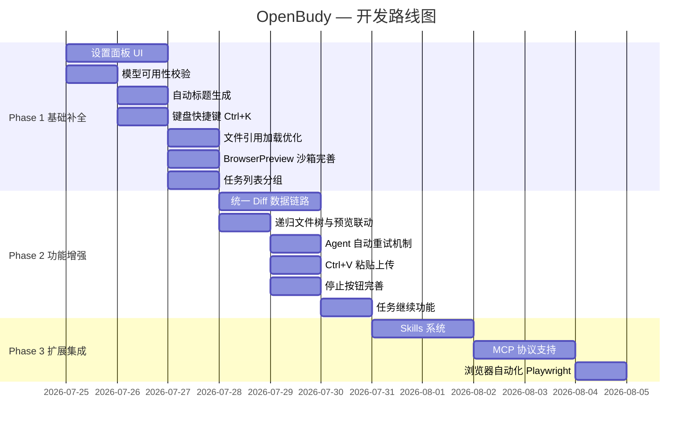

# OpenBudy — 实现规划文档 v1.1

> **版本**: v1.1
> **日期**: 2026-07-25
> **阶段**: 代码实施阶段
> **上游文档**: openbudy-feature-research.md v3.1
> **目标**: 将需求规划转化为可执行的开发任务

---

## 目录

- [一、项目现状总览](#一项目现状总览)
- [二、开发阶段划分](#二开发阶段划分)
- [三、Phase 1: 基础补全（P0 缺口修复）](#三phase-1-基础补全p0-缺口修复)
- [四、Phase 2: 功能增强（P0 体验优化）](#四phase-2-功能增强p0-体验优化)
- [五、Phase 3: 扩展集成（P1 后续版本）](#五phase-3-扩展集成p1-后续版本)
- [六、技术债与架构优化](#六技术债与架构优化)
- [七、测试清单](#七测试清单)
- [八、发布检查表](#八发布检查表)

---

## 一、项目现状总览

### 1.1 完成度矩阵

| 模块 | 完成度 | 状态 | 说明 |
| ------ | :---: | :---: | ------ |
| **项目脚手架** | 100% | ✅ | package.json / tsconfig / vite.config / electron-builder 齐全 |
| **类型定义** | 100% | ✅ | Task / Message / AgentEvent / ToolDefinition / ModelConfig 等完整 |
| **数据层 (Dexie.js)** | 100% | ✅ | tasks / messages / artifacts 三表 + 索引 |
| **Zustand Stores** | 100% | ✅ | taskStore / chatStore / settingsStore / resultStore 全部实现 |
| **Agent Core** | 85% | 🟡 | 主循环已完成，但自动重试、错误分级与可观测性仍未补齐 |
| **LLM Client** | 100% | ✅ | 流式 SSE / DeepSeek / ModelRegistry |
| **5 内置工具** | 100% | ✅ | shell / file-read / file-write / web-search(mock) / web-fetch |
| **Electron 主进程** | 95% | ✅ | main / preload / IPC(agent/file/storage) 已完成 |
| **IPC Mock 模式** | 95% | ✅ | 浏览器 dev 可独立运行 |
| **布局组件** | 100% | ✅ | AppLayout / Sidebar / ChatArea / ResultPanel |
| **对话组件** | 90% | 🟡 | ChatInput 文件引用加载待优化 |
| **任务组件** | 80% | 🟡 | 右键菜单已实现，但缺自动标题与按 workspace 分组 |
| **结果组件** | 70% | 🟡 | DiffView 使用 mock 数据，文件树非递归，FilePreview 仍待收口 |
| **Hooks** | 100% | ✅ | useAgent / useTask / useFileUpload |
| **设置面板 UI** | 0% | ❌ | settingsStore 有 `settingsOpen` 但无对应 UI 组件 |
| **主题系统** | 100% | ✅ | ConfigProvider 深色/浅色切换 |

### 1.2 技术栈确认

| 层级 | 技术 | 版本 | 状态 |
| ------ | ------ | :---: | :---: |
| 桌面框架 | Electron | 30 | ✅ 已配置 |
| 构建工具 | Vite + vite-plugin-electron | 5 | ✅ 已配置 |
| 前端框架 | React | 19 | ✅ |
| UI 组件库 | Ant Design | 6 | ✅ |
| 状态管理 | Zustand | 4 | ✅ |
| 数据存储 | Dexie.js | 4 | ✅ |
| Markdown | react-markdown + remark-gfm + rehype-highlight | - | ✅ |
| 代码编辑器 | @monaco-editor/react | 4 | ✅ |
| AI 模型 | DeepSeek（OpenAI 兼容） | - | ✅ |

---

## 二、开发阶段划分



---

## 三、Phase 1: 基础补全（P0 缺口修复）

### 3.1 设置面板 UI 组件

> **优先级**: P0 | **预估工时**: 2h
> **需求 ID**: F1.1 ~ F1.4, F2.1 ~ F2.2

#### 3.1.1 现状

- `settingsStore` 已实现 `settingsOpen` 状态和 `setSettingsOpen` 方法
- `Sidebar.tsx` 中已有设置按钮 `<Button icon={<SettingOutlined />} onClick={() => setSettingsOpen(true)} />`
- `ModelsConfig` 类型完整，包含 API Key、模型列表、默认模型等信息

#### 3.1.2 需要实现

**新建文件**: `src/components/settings/SettingsModal.tsx`

```
SettingsModal
├── Tabs
│   ├── Tab: "模型配置"
│   │   ├── 默认模型 Select（从已注册模型中选择）
│   │   ├── 模型列表 Table（name / provider / baseUrl / API Key / 操作）
│   │   │   ├── 每行: [模型名称] [提供商] [API 端点] [Key(密码框)] [编辑][删除]
│   │   │   └── 支持 inline 编辑或弹出编辑
│   │   └── 添加自定义模型 Button → Modal.Form
│   │       ├── id (自动生成)
│   │       ├── name
│   │       ├── provider
│   │       ├── baseUrl
│   │       ├── apiKey (Input.Password)
│   │       ├── maxInputTokens
│   │       ├── maxOutputTokens
│   │       └── supportsToolCalling (Switch)
│   └── Tab: "工作区"
│       ├── 当前工作区路径展示
│       └── 选择目录 Button（调用 ipc.selectDirectory）
└── Footer: [取消] [保存]
```

#### 3.1.3 实现步骤

1. 创建 `src/components/settings/SettingsModal.tsx`
2. 使用 `Modal` + `Tabs` 组织布局
3. "模型配置" Tab:
   - 使用 `Table` 展示模型列表，columns: name, provider, baseUrl, apiKey(脱敏), actions
   - apiKey 列使用 `Input.Password` 内联编辑
   - "添加模型" 按钮弹出 `Modal` + `Form`，字段如上定义
   - 删除需 `Popconfirm` 二次确认（不允许删除最后一个模型）
4. "工作区" Tab:
   - 展示当前 `workspaceRoot`
   - "选择目录" 调用 `ipc.selectDirectory()` → `setWorkspaceRoot()`
5. 关闭时自动持久化（store 已实现 persist）
6. 在 `AppLayout.tsx` 中引入 `SettingsModal`

#### 3.1.4 关键代码骨架

```tsx
// src/components/settings/SettingsModal.tsx
import { Modal, Tabs, Table, Button, Input, Select, Switch, Popconfirm } from 'antd'
import type { ColumnsType } from 'antd/es/table'
import { PlusOutlined, DeleteOutlined } from '@ant-design/icons'
import { useSettingsStore } from '../../stores/settingsStore'
import { ipc } from '../../services/ipc'
import type { ModelConfig } from '../../types'

export default function SettingsModal() {
  const open = useSettingsStore(s => s.settingsOpen)
  const setOpen = useSettingsStore(s => s.setSettingsOpen)
  const modelsConfig = useSettingsStore(s => s.modelsConfig)
  const workspaceRoot = useSettingsStore(s => s.workspaceRoot)
  const updateModel = /* 更新单个模型配置 */
  const addModel = /* 添加新模型 */
  const removeModel = /* 删除模型（>=2个时允许） */
  const setDefaultModel = useSettingsStore(s => s.setDefaultModel)
  const setWorkspaceRoot = useSettingsStore(s => s.setWorkspaceRoot)

  // ... 组件实现
}
```

#### 3.1.5 验收标准

- [ ] 设置面板可通过侧边栏齿轮图标打开
- [ ] API Key 以密码框形式输入，不可见
- [ ] 可添加自定义 OpenAI 兼容模型
- [ ] 可切换默认模型
- [ ] 删除最后一个模型时不允许操作，显示提示
- [ ] 工作区路径可查看和选择

---

### 3.2 模型可用性校验与执行前拦截

> **优先级**: P0 | **预估工时**: 0.5h
> **需求 ID**: F1.2, F1.3, E4

#### 3.2.1 现状

当前设置链路只覆盖了模型配置持久化，没有把“模型是否可执行”纳入提交前校验。

- `useAgent.ts` 在执行前只读取 `modelId`
- 当前没有检查 `apiKey` 是否为空
- 当前没有区分 `401 / 429 / 5xx / 网络异常` 的用户提示
- 测试清单已经包含“空 Key 阻止执行”，但阶段任务中未拆解该项

#### 3.2.2 需要实现

1. 发送前校验当前任务绑定模型是否存在
2. 发送前校验目标模型 `apiKey` 非空，否则 toast 警告并阻止执行
3. 统一错误码映射：`401 → E001`、`429 → E002`、`5xx/超时 → E003`、网络异常 → `E009`
4. 在设置面板中对默认模型缺少 Key 给出显式提示

#### 3.2.3 实现步骤

1. **修改 `useAgent.ts`**
   - 在调用 `ipc.agentExecute()` 前，按 `modelId` 找到当前模型配置
   - 若未找到模型或 `apiKey` 为空，直接 `message.warning()` 并返回
2. **修改 `agent-core/llm/client.ts` 或调用层错误适配**
   - 将 HTTP 状态码映射为统一错误文案
   - 保留原始错误以便调试日志记录
3. **修改 `SettingsModal.tsx`**
   - 在模型列表中展示 “未配置 API Key” 状态
   - 默认模型无 Key 时禁止关闭或至少显示醒目提醒

#### 3.2.4 验收标准

- [ ] 默认模型未配置 API Key 时，发送消息被拦截
- [ ] 无效 Key 返回 401 时，用户收到明确的 “API Key 无效” 提示
- [ ] 429 / 5xx / 网络异常的提示可区分，不再统一落入 “执行失败”

---

### 3.3 自动任务标题生成

> **优先级**: P0 | **预估工时**: 0.5h
> **需求 ID**: C1.6.3

#### 3.3.1 需要实现

在 `NewTaskButton.tsx` 的 `handleSubmit` 中，如果 `title` 为空，自动从用户消息中截取前 30 个字符作为标题。

#### 3.3.2 实现位置

修改 `src/components/task/NewTaskButton.tsx` 的 `handleSubmit`：

```tsx
const handleSubmit = async () => {
  const values = await form.validateFields()
  const title = values.title?.trim() || '未命名任务'
  await createAndSelect(title, values.mode, values.modelId, values.workspacePath)
  // ...
}
```

> 注: 当前表单中 title 是必填字段，需要先将其改为可选，再添加 fallback 逻辑。
> 更优方案: 在 `ChatInput` 发送第一条消息时，如果任务标题仍为默认值或空，自动更新标题。

修改 `src/hooks/useAgent.ts` 的 `execute` 方法：

```typescript
// 发送消息时，如果任务标题为空，用消息前 30 字符自动填充
const execute = useCallback(async (userMessage: string) => {
  if (!taskId) return
  const task = taskStore.getState().tasks.find(t => t.id === taskId)
  if (task && (!task.title || task.title === '未命名任务')) {
    const autoTitle = userMessage.slice(0, 30) + (userMessage.length > 30 ? '...' : '')
    await taskStore.getState().updateTask(taskId, { title: autoTitle })
  }
  // ... 继续原有逻辑
}, [taskId])
```

---

### 3.4 键盘快捷键 Ctrl+K

> **优先级**: P0 | **预估工时**: 0.5h
> **需求 ID**: E2

#### 3.4.1 需要实现

全局监听 `Ctrl+K` / `Cmd+K` 快捷键打开新建任务弹窗。

#### 3.4.2 实现位置

在 `src/App.tsx` 或 `src/components/layout/AppLayout.tsx` 中添加全局键盘事件监听：

```tsx
useEffect(() => {
  const handler = (e: KeyboardEvent) => {
    if ((e.ctrlKey || e.metaKey) && e.key === 'k') {
      e.preventDefault()
      // 触发 NewTaskButton 的 open 状态
      // 方案：通过 store 或自定义事件
    }
  }
  window.addEventListener('keydown', handler)
  return () => window.removeEventListener('keydown', handler)
}, [])
```

推荐方案：在 `taskStore` 中添加 `newTaskModalOpen: boolean` 状态，`NewTaskButton` 监听该状态。

---

### 3.5 文件引用加载优化

> **优先级**: P0 | **预估工时**: 0.5h
> **需求 ID**: C1.4

#### 3.5.1 现状

`ChatInput.tsx` 中有 `loadRefFiles` 方法和 `@引用` 的 UI，但未在合适时机触发加载。

#### 3.5.2 需要实现

- 当任务 workspace 变化时自动调用 `loadRefFiles()`
- 键盘输入 `@` 时自动弹出文件引用列表

#### 3.5.3 实现

在 `ChatInput.tsx` 中添加：

```tsx
// 监听 @ 输入
const handleChange = (e: React.ChangeEvent<HTMLTextAreaElement>) => {
  const val = e.target.value
  setValue(val)
  // 检测 @ 触发
  if (val.endsWith('@') && task) {
    void loadRefFiles()
  }
}
```

---

### 3.6 BrowserPreview 沙箱完善

> **优先级**: P0 | **预估工时**: 0.5h
> **需求 ID**: D5

#### 3.6.1 现状

当前 iframe `sandbox` 属性为 `allow-scripts`，过于宽松。

#### 3.6.2 需要修改

```tsx
<iframe
  sandbox="allow-scripts allow-same-origin"
  // 移除 allow-forms 和 allow-popups 以增强安全性
/>
```

---

### 3.7 任务列表按 Workspace 分组

> **优先级**: P0 | **预估工时**: 0.5h
> **需求 ID**: A2.1

#### 3.7.1 现状

当前 `TaskList` 仅做搜索、筛选和按更新时间排序，未按 `workspacePath` 分组展示。

#### 3.7.2 需要实现

1. 以 `workspacePath` 为一级分组键
2. 每组展示工作区名称、任务数量和折叠状态
3. 置顶任务仍保持组内优先排序

#### 3.7.3 实现建议

- 使用 `Map<string, Task[]>` 或 `Object.groupBy` 对任务先分组再渲染
- UI 上可用 `Collapse`、分组标题 `Typography.Text` 或 `List` + 自定义 header
- 当工作区为空或默认路径时，展示易读名称而不是完整绝对路径

#### 3.7.4 验收标准

- [ ] 左侧任务列表按 workspace 分组展示
- [ ] 同组内任务仍支持搜索、筛选和置顶排序
- [ ] 点击任务后仍正确切换会话与结果区

---

## 四、Phase 2: 功能增强（P0 体验优化）

### 4.1 统一 Diff 数据链路

> **优先级**: P0 | **预估工时**: 1.5h
> **需求 ID**: C2.3

#### 4.1.1 设计方案

Diff 只应保留一套实现路径，避免 “前端事后读文件” 和 “后端写前备份” 两套方案并存。

推荐采用以下单一路径：

1. `executor.ts` 在执行 `file_write` 前读取原始内容
2. 写入成功后再次读取最新内容
3. 通过 `agent:event` 新增 `file_changed` 事件，把 `path / originalContent / modifiedContent` 发给前端
4. `resultStore.changedFiles` 存储结构升级为可直接驱动 `DiffView`
5. `DiffView` 只消费 store 数据，不再依赖“重新读取原始文件”推断历史

#### 4.1.2 实现

需要同步修改以下模块：

1. **`src/types/index.ts`**

- 新增 `file_changed` 事件类型
- 为 `ChangedFile` 增加 `originalContent`、`modifiedContent`、`filePath`

1. **`agent-core/executor.ts`**

- 在 `file_write` 前后采集文件内容

1. **`agent-core/loop.ts` / `electron/ipc/agent.ts`**

- 将文件变更事件透传到渲染进程

1. **`src/hooks/useAgent.ts`**

- 监听 `file_changed` 并写入 `resultStore`

1. **`src/components/result/DiffView.tsx`**

- 直接展示选中文件的 `originalContent` 与 `modifiedContent`

```typescript
// 推荐伪代码
if (call.name === 'file_write') {
  const filePath = path.resolve(context.workspacePath, String(call.arguments.path))
  let originalContent = ''
  try {
    originalContent = await fs.readFile(filePath, 'utf-8')
  } catch { /* 新文件 */ }

  const result = await toolRegistry.execute(call.name, call.arguments, context)

  const modifiedContent = await fs.readFile(filePath, 'utf-8')
  emitFileChanged({ filePath, originalContent, modifiedContent })
}
```

不建议继续采用“前端收到 tool_result 后自行补读原始文件”的方案，因为原始内容在写入后已不可恢复。

#### 4.1.3 验收标准

- [ ] `file_write` 成功后立即出现文件变更记录
- [ ] Diff 视图展示真实写前/写后内容，而非占位字符串
- [ ] 新建文件、覆盖文件、连续多次修改同一文件三种场景都可正常展示

---

### 4.2 递归文件树与预览联动

> **优先级**: P0 | **预估工时**: 0.5h
> **需求 ID**: C2.2

#### 4.2.1 现状

当前 `file:list` IPC 只返回单层目录内容，`FileTree` 虽预留 `children` 字段，但实际拿不到递归树。

#### 4.2.2 需要实现

1. `electron/ipc/file.ts` 递归读取目录结构
2. `FileTree` 直接消费递归 `children`
3. 选中文件后联动 `FilePreview`

#### 4.2.3 验收标准

- [ ] 嵌套目录可展开
- [ ] 点击任意叶子文件可预览内容
- [ ] 大目录加载时有基本 loading 状态

---

### 4.3 Agent 自动重试机制

> **优先级**: P0 | **预估工时**: 1h
> **需求 ID**: B1.4, R1, R4

#### 4.3.1 现状

`monitor.ts` 已存在 `MAX_RETRIES`、`shouldRetry()`、`backoffDelay()`，但 `loop.ts` 并未实际调用，当前一旦 LLM 失败会直接结束任务。

#### 4.3.2 需要实现

1. 明确仅对可重试错误自动重试：网络抖动、429、部分 5xx、SSE 中断
2. 对不可重试错误直接失败：401、模型不存在、参数错误、用户取消
3. 重试过程向对话区发送状态提示，如“第 2/3 次重试中”
4. 达到上限后再进入 failed

#### 4.3.3 验收标准

- [ ] 可重试错误会在 3 次内自动重试
- [ ] 不可重试错误不会重复请求
- [ ] 用户能看到当前重试状态与最终失败原因

---

### 4.4 Ctrl+V 粘贴上传

> **优先级**: P0 | **预估工时**: 0.5h
> **需求 ID**: C1.4

#### 4.2.1 实现

在 `ChatInput.tsx` 中添加 paste 事件处理：

```tsx
const handlePaste = async (e: React.ClipboardEvent) => {
  const items = e.clipboardData?.items
  if (!items) return
  
  for (const item of items) {
    if (item.kind === 'file') {
      e.preventDefault()
      const file = item.getAsFile()
      if (file) {
        await upload(file)
      }
      return
    }
  }
}

// 在 Input.TextArea 上绑定
<Input.TextArea onPaste={handlePaste} ... />
```

---

### 4.5 任务停止按钮完善

> **优先级**: P0 | **预估工时**: 0.5h
> **需求 ID**: B1.5

#### 4.3.1 现状检查

`useAgent.ts` 中已实现 `stop` 方法，通过 `ipc.agentStop(taskId)` 通知主进程。需确认 `ChatInput.tsx` 中的停止按钮是否正确绑定。

#### 4.3.2 需要检查/完善

- `ChatInput.tsx` 中: 当 `isRunning` 时显示"停止"按钮
- 停止后 `isRunning` 状态正确重置
- `taskStore` 中任务状态更新为 `stopped`

---

### 4.6 任务失败后继续对话

> **优先级**: P0 | **预估工时**: 1h
> **需求 ID**: A2.8

#### 4.4.1 需要实现

当任务状态为 `failed` 或 `stopped` 时，允许用户继续发送消息，Agent 应基于之前的上下文继续执行。

#### 4.4.2 实现

1. `ChatInput.tsx` — 移除对 `isRunning` 的禁用判断，改为仅当 `status === 'archived'` 时禁用输入
2. `useAgent.ts` — 执行前重置任务状态从 `failed`/`stopped` → `running`
3. `agent-core/loop.ts` — 已支持传入 `historyMessages`，无需修改

---

## 五、Phase 3: 扩展集成（P1 后续版本）

### 5.1 Skills 技能系统

> **优先级**: P1 | **预估工时**: 2h
> **需求 ID**: D1, D2

#### 5.1.1 设计

```
agent-core/skills/
├── loader.ts        # SKILL.md 文件加载器
├── registry.ts      # 技能注册中心
└── injector.ts      # 技能注入器（拼接到 system prompt）
```

#### 5.1.2 SKILL.md 格式

```markdown
---
name: data-analyst
description: 数据分析专家技能
role: 你是一个数据分析专家
sop:
  1. 读取数据文件
  2. 分析数据结构
  3. 生成可视化报告
domain_knowledge: |
  熟悉 Python pandas、matplotlib 等数据分析工具...
---
```

#### 5.1.3 实现

1. 在 `planner.ts` 的 `buildSystemPrompt` 中注入已加载的 skills 的 role/sop
2. 在 settingsStore 中增加 `skillsDir: string` 配置
3. Worker 目录自动扫描 `*.skill.md` 文件

---

### 5.2 MCP 协议支持

> **优先级**: P1 | **预估工时**: 2h
> **需求 ID**: B2.4

#### 5.2.1 设计

```
agent-core/mcp/
├── client.ts     # MCP 客户端（连接 MCP Server）
├── transport.ts  # 传输层（stdio / SSE）
└── converter.ts  # MCP Tool → ToolDefinition 转换
```

#### 5.2.2 实现要点

1. 通过 `child_process.spawn` 启动 MCP Server
2. 使用 JSON-RPC 2.0 协议通信
3. `tools/list` 获取工具列表 → 注册到 `toolRegistry`
4. `tools/call` 执行工具调用

---

### 5.3 浏览器自动化 (Playwright)

> **优先级**: P1 | **预估工时**: 1h
> **需求 ID**: D3

#### 5.3.1 设计

新增 `agent-core/tools/browser.ts` 工具：

- `browser_navigate`: 导航到 URL
- `browser_click`: 点击元素
- `browser_type`: 输入文本
- `browser_screenshot`: 截图
- `browser_get_content`: 获取页面内容

使用 Playwright 的 `chromium.launch()` 在 headless 模式下运行。

---

## 六、技术债与架构优化

### 6.1 类型导入路径

**问题**: `agent-core/` 下的文件通过相对路径 `../../src/types` 导入类型，这会导致：

1. 循环依赖风险
2. 打包时类型推断问题

**建议方案**: 将共享类型提取到独立包或使用 tsconfig paths：

```json
// tsconfig.json 已配置
"paths": {
  "@/*": ["src/*"],
  "@agent/*": ["agent-core/*"]
}
```

并在 `agent-core/` 中复用：

```typescript
// 使用绝对导入
import type { ToolDefinition } from '@/types'
```

> 注: 当前 agent-core 中混合使用相对路径和 paths 别名，需要统一。

### 6.2 错误处理增强

**问题**: 当前部分 catch 块仅 `console.error`，未向用户反馈友好错误信息。

**建议**: 统一错误处理策略：

- API 层错误 → 错误码映射 (E001~E010，见需求文档 9.4)
- 用户可恢复的错误 → Toast 提示
- 系统级错误 → 错误边界组件

### 6.3 并发安全性

**问题**: 同一任务内的 IndexedDB 操作可能在 Agent 事件回调中并发写入。

**建议**:

- `chatStore.appendTextDelta` 使用 `get()` + `set()` 可能产生竞态
- 改为使用 Dexie 的 `db.transaction('rw', db.messages, async () => {...})` 包裹

---

## 七、测试清单

### 7.1 端到端验收场景（MVP）

| # | 场景 | 操作 | 预期结果 | 状态 |
| --- | ------ | ------ | --------- | :---: |
| 1 | 启动应用 | `pnpm dev` | 三区域布局 + 深色主题 | ⬜ |
| 2 | 创建设置 API Key | 设置面板 → 输入 DeepSeek Key → 保存 | Key 持久化 | ⬜ |
| 3 | 创建任务 | 新建 → 填写标题/模式 → 发送 | 任务出现在对应 workspace 分组下 | ⬜ |
| 4 | 发送消息 | 选中任务 → 输入 → Ctrl+Enter | 消息显示在对话区 | ⬜ |
| 5 | Agent 流式响应 | 发送后 → 等待 | 流式文本 + 工具调用卡片 + 状态流转 | ⬜ |
| 6 | 任务状态流转 | 观察执行过程 | planning → running → completed / failed / stopped | ⬜ |
| 7 | 搜索筛选 | 搜索框输入 → 筛选下拉 | 列表正确过滤 | ⬜ |
| 8 | 结果面板 | 右侧 Tabs 切换 | 概览/产物/变更 内容正确 | ⬜ |
| 9 | 文件树浏览 | 点击嵌套文件 | Monaco 预览内容 | ⬜ |
| 10 | 主题切换 | 点击灯泡/月亮图标 | 深色 ↔ 浅色 全局生效 | ⬜ |
| 11 | API Key 无效 | 设置空 Key → 发送 | 显示警告，阻止执行 | ⬜ |
| 12 | 自动重试 | 模拟 429 / 网络抖动 | 任务自动重试，最多 3 次 | ⬜ |
| 13 | 停止任务 | 执行中点停止按钮 | 任务 → stopped，可继续 | ⬜ |
| 14 | Diff 展示 | Agent 修改文件后切到变更面板 | 展示真实写前/写后内容 | ⬜ |

### 7.2 技术验收标准

| # | 标准 | 验证方式 |
| --- | ------ | --------- |
| 1 | TypeScript 编译零错误 | `pnpm lint` (tsc --noEmit) |
| 2 | Vite 构建成功 | `pnpm build` |
| 3 | Electron 启动正常 | `pnpm electron:dev` |
| 4 | Agent Loop 自动重试生效 | 模拟 429 / 网络异常并观测最多 3 次重试 |
| 5 | Agent Loop 30 轮限制 | 构造循环 prompt 测试 |
| 6 | 沙箱拦截危险命令 | `rm -rf /` 测试 |
| 7 | 递归文件树正确 | 构造 3 层目录并验证可展开/预览 |
| 8 | IndexedDB 读写 | 1000 条消息 < 100ms |

---

## 八、发布检查表

### 8.1 MVP 发布前

- [ ] 所有 P0 缺口修复完成
- [ ] TypeScript 编译零错误
- [ ] 浏览器 Mock 模式正常运行
- [ ] Electron 桌面模式正常运行
- [ ] 设置面板 UI 可正常配置 API Key
- [ ] 未配置 API Key 时不能发起真实任务执行
- [ ] 一个完整的 Ask 模式对话可走通
- [ ] 一个完整的 Craft 模式对话可走通
- [ ] 自动重试、停止、继续三条异常流程都已验证
- [ ] 任务列表已按 workspace 分组
- [ ] 递归文件树 + 真实 Diff 已可用
- [ ] 深色/浅色主题切换正常
- [ ] 任务 CRUD 正常
- [ ] README.md 更新（包含运行说明、架构图）

### 8.2 V1.1 发布前

- [ ] Skills 系统可用
- [ ] MCP 协议支持
- [ ] 浏览器自动化可用
- [ ] 所有 P1 功能完成

---

> **下一步行动**:
>
> 1. 按 Phase 1 → Phase 2 → Phase 3 顺序执行
> 2. Phase 1 中建议优先完成 3.1 + 3.2，这两项共同构成“可配置且可执行”的最小入口
> 3. 每完成一个 Phase 执行一次 `pnpm lint` 确保无编译错误
> 4. 建议使用 `pnpm dev` 浏览器模式进行日常开发调试，仅在需要文件系统/Ipc 功能时使用 Electron 模式
>
> **预估总工时**: Phase 1 (4.5h) + Phase 2 (5h) + Phase 3 (5h) ≈ **14.5h**
