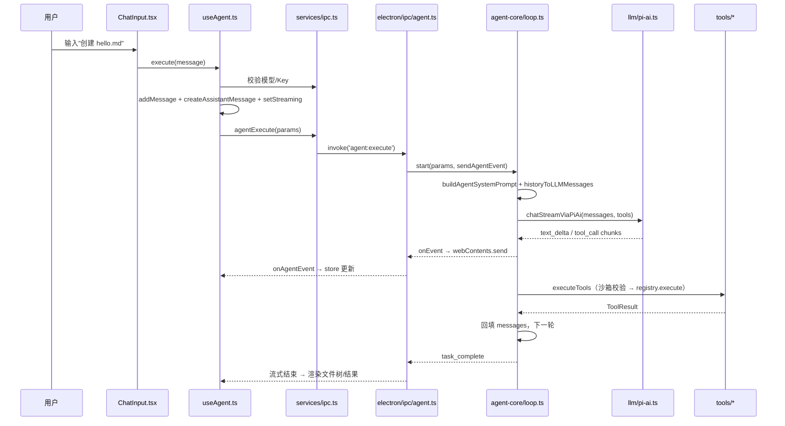

# 第 11 章 · 全链路串讲：一次任务的完整旅程

本章把前十章的知识点串成一条线：跟随一条消息走完全程。

## 11.1 端到端时序总图



## 11.2 三个完整案例

### 案例 1：写文件并打开

> 「在工作区创建 hello.md，写上 # Hello OpenBudy，然后告诉我写在哪了」

| 阶段 | 发生的事 |
| --- | --- |
| 1 | `file_write(path, content)` 工具调用（第 7 章的校验链） |
| 2 | handler `fs.mkdir` + `fs.writeFile` 落盘到 `~/openbudy-workspace/<taskId>/` |
| 3 | 回填「已写入文件：hello.md（N bytes）」，模型总结 |
| 4 | UI 层：工具卡片出现**打开文件 / 打开文件夹**按钮（`file:openPath` / `file:openInFolder` IPC，底层 `shell.openPath`） |
| 5 | 右侧文件树刷新（`file:list`），显示新文件 |

### 案例 2：搜索网页并总结

> 「搜索 2025 年 Electron 最新版本特性并总结」

| 阶段 | 发生的事 |
| --- | --- |
| 1 | `web_search("Electron 最新版本 特性")` |
| 2 | 结果链接回填，模型挑选相关页 |
| 3 | `web_fetch(url)` 抓正文（提示注入风险点——第 10 章的沙箱语境） |
| 4 | 模型基于正文总结，`text_delta` 流式输出 |

### 案例 3：跑命令并修复报错

> 「用 node 跑 demo.js，如果有报错就修复它」

| 阶段 | 发生的事 |
| --- | --- |
| 1 | `file_write(demo.js, ...)` |
| 2 | `shell_execute("node demo.js")` → stderr 报错 |
| 3 | **错误输出原样回填**（`isError: true`）——模型"读"到报错 |
| 4 | 模型 `file_write` 修复 → 再次 `shell_execute` → 成功退出码 |
| 5 | `task_complete` |

案例 3 是 Agent 价值的核心展示：**错误反馈驱动自我修复**。工具输出不做任何美化，把真实的 stderr 给模型，它才能精确修复。

## 11.3 数据持久化：Dexie（IndexedDB）

任务与消息存在渲染进程的 IndexedDB（[src/services/db.ts](https://github.com/pengjinning/openbudy/blob/main/src/services/db.ts)），与主进程的配置文件（`~/.openbudy/config.json`）分工明确：

| 数据 | 存储位置 | 理由 |
| --- | --- | --- |
| 任务 / 消息 / 工具调用记录 | IndexedDB（Dexie） | 结构化、随 UI 查询（按任务分组）、免 IPC |
| 模型配置 + API Key | 主进程 JSON 文件 | Key 不进渲染进程（第 4 章安全设计） |
| 任务产物（文件） | 文件系统 `~/openbudy-workspace/<taskId>` | Agent 工作成果 |

```ts
// Dexie 定义示意
class OpenBudyDB extends Dexie {
  tasks!: Table<Task>
  messages!: Table<Message>
  constructor() {
    super('openbudy')
    this.version(1).stores({
      tasks: 'id, updatedAt, status',
      messages: 'id, taskId, createdAt',   // taskId 索引 → 按任务取消息
    })
  }
}
```

配合 `dexie-react-hooks` 的 `useLiveQuery`，UI 与 DB 自动同步。Zustand 负责**会话内**状态（流式进度、当前选中任务），Dexie 负责**跨会话**持久化——两层各司其职。

## 11.4 结果面板三件套

右侧面板把 Agent 的工作成果可视化：

| 组件 | 数据来源 | 功能 |
| --- | --- | --- |
| `FileTree.tsx` | `file:list` IPC | 工作区文件树，支持打开文件/文件夹 |
| `FilePreview.tsx` + Monaco | `file:read` | 语法高亮预览 |
| `DiffView.tsx` | 工具调用记录 | 展示 file_write 前后差异 |

`DiffView` 的思路值得注意：diff 数据不需要额外存储——`file_write` 的**调用参数里就有完整新内容**，与旧文件对比即可渲染。

## 11.5 实战：全链路断点走查

用 DevTools 走一遍真实任务的完整链路，巩固理解：

1. `pnpm electron:dev`，打开渲染进程 DevTools（自动）与主进程终端
2. Network 面板：能看到发往 `open.bigmodel.cn` 的流式请求（SSE，持续接收）
3. Console 里监听原始事件：

```js
const stop = window.electronAPI.onAgentEvent((e) => console.log(e))
// 发送一条任务，观察事件序列：
// status_change → thinking → text_delta×N → tool_call → tool_result → ... → task_complete
```

4. 观察完成后 `stop()` 解绑
5. 检查 `~/openbudy-workspace/<taskId>/` 与 DevTools → Application → IndexedDB → openbudy

**验收标准**：你能指着每一个文件说出它在链路中的角色。能做到，本教程的 80% 已经内化。

## 11.6 小结

- 一次任务 = UI 收集 → IPC 启动 → Loop 循环 → 工具落盘 → 事件回推 → 面板可视化
- 错误输出原样回填是自我修复能力的来源
- 双存储分工：IndexedDB 存对话、主进程文件存 Key、文件系统存产物
- diff 不必额外存储，工具调用参数即 diff 数据
