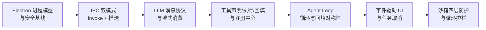

# 第 14 章 · 展望与学习路径

## 14.1 回顾：你已经掌握了什么

走完前十三章，你已经能独立实现并扩展一个完整的桌面 Agent：

更重要的是背后的**可迁移模式**：防腐层、白名单桥接、判别联合事件、错误即反馈、防御纵深——它们适用于任何 Agent 技术栈。

## 14.2 下一步方向

### MCP（Model Context Protocol）

本教程的工具是「内置注册」的——宿主自己写 handler。MCP 把工具做成**标准化外部服务**：任何 MCP Server（文件系统、GitHub、数据库……）都能被任何 MCP Client（你的 Agent）即插即用。

在 OpenBudy 架构里接入 MCP 的路径是天然的：`registry.register()` 换成「启动时枚举 MCP Server 并动态注册其工具」；loop 与事件体系完全不用动。可以把 MCP 理解为「工具层的 USB 协议」。

### 子代理（Sub-agent）

复杂任务拆给多个专职 Agent（规划者 / 执行者 / 审查者）。在 `agent-core` 中实现：再包一层循环，`planner.ts` 按任务派发，子 Agent 的工具结果汇总给父 Agent。事件体系需要扩展 `parentTaskId` 之类的字段做树状路由。

### 记忆与上下文压缩

`historyToLLMMessages`（第 8 章）目前全量重放历史——长任务会把上下文撑爆。改进方向：

- **滑动窗口**：只保留最近 N 轮完整对话 + 更早轮次的摘要
- **结构化记忆**：把工具结果（如大文件内容）落盘为「记忆条目」，消息里只放引用
- **检索增强**：按当前任务语义检索相关记忆再注入

### 人工确认门控（Human-in-the-loop）

第 10 章的「危险操作确认」目前靠系统提示词（软约束）。升级为硬门控：新增 `tool_confirm` 事件类型，executor 遇白名单内高危工具时暂停循环、等 UI 返回 `confirm`/`deny` 再继续——把 AbortController 的 Map 扩展为「每任务一个待确认 Promise」即可实现。

### 多模态

图片输入（截图理解）、语音对话、计算机操作（Computer Use）。工具体系完全复用，变的是 `LLMMessage` 的 content 从纯文本扩展为多模态数组。

## 14.3 学习路径建议

| 阶段 | 做什么 |
| --- | --- |
| **巩固**（1 周） | 把第 7、9、12 章的实战全部亲手做一遍；不看书画出全链路时序图 |
| **扩展**（2-4 周） | 给自己的工作流写 2-3 个定制工具；接入自己常用的模型；调教出专属提示词 |
| **深挖**（1-2 月） | 实现上下文压缩；加 human-in-the-loop 门控；尝试接入一个 MCP Server |
| **创造** | 把 `agent-core` 移植到新宿主（CLI / Web 服务 / VS Code 插件），验证解耦设计的价值 |

## 14.4 延伸阅读

| 资源 | 说明 |
| --- | --- |
| [pi-ai (npm)](https://www.npmjs.com/package/@earendil-works/pi-ai) | 本教程使用的 LLM SDK，看模型目录与 Provider 抽象 |
| [Electron 官方安全指南](https://www.electronjs.org/docs/latest/tutorial/security) | 第 3、10 章安全设计的权威出处 |
| [Electron IPC 文档](https://www.electronjs.org/docs/latest/tutorial/ipc) | `handle/invoke` 与 `send/on` 的完整 API |
| [智谱开放平台](https://open.bigmodel.cn/) | GLM 系列模型与 API 文档 |
| [OpenAI Function Calling 指南](https://platform.openai.com/docs/guides/function-calling) | 工具调用协议的原始定义 |
| [Model Context Protocol](https://modelcontextprotocol.io/) | 工具生态标准化的未来方向 |
| [Anthropic: Building effective agents](https://www.anthropic.com/engineering/building-effective-agents) | Agent 模式（routing / parallel / orchestrator）的经典总结 |

## 14.5 结语

Agent 开发的门槛从来不是「调 API」，而是把**流式、工具、循环、安全、UI**这五件事工程化地缝合成一个可靠的产品。OpenBudy 用不到一万行 TypeScript 完成了这次缝合，希望本教程让你看清了每一针。

现在，回到[第 12 章](/advanced/extending)，做第一个属于你自己的工具吧。
