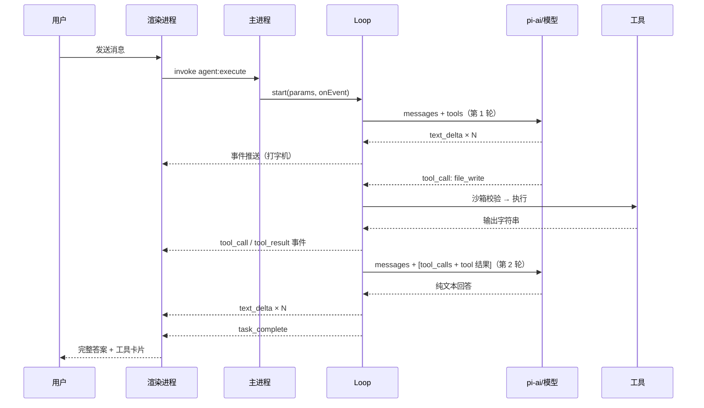

# 第 8 章 · Agent Loop：从对话到自主执行

前三篇的零件——IPC、LLM 流、工具——在本章装配成 Agent 的心脏。

## 8.1 核心循环：一段伪代码

先看全景（30 行以内）：

```
messages = [system, ...历史, 用户消息]
tools = 注册中心的全部声明

循环（最多 30 次）:
    检查取消 / 超时

    流式调用 LLM（messages + tools）:
        text chunk      → 推送 text_delta 事件
        tool_call chunk → 收集
    流结束

    如果没有 tool_calls:
        推送 task_complete，结束 ✅

    执行收集到的每个工具（沙箱校验 → registry.execute）
        → 推送 tool_call / tool_result 事件

    把 assistant(tool_calls) 和每个 tool 结果追加进 messages
    继续下一轮
```

就这么多。所有 Agent 框架的核心都是这个循环，差异只在工具丰富度与护栏设计。

## 8.2 精读：agent-core/loop.ts

### 入口与参数

```ts title="agent-core/loop.ts（节选）"
export interface AgentLoopParams {
  taskId: string
  userMessage: string
  modelConfig: ModelConfig
  workspacePath: string
  historyMessages: Array<{
    role: string
    content: string
    toolCalls?: ToolCall[]
    toolResults?: ToolResult[]
  }>
  signal?: AbortSignal   // 取消信号，贯穿全程
}

export async function start(
  params: AgentLoopParams,
  onEvent: (event: AgentEvent) => void
): Promise<void> { ... }
```

`onEvent` 回调是 loop 与外界唯一的输出通道（主进程把它接到 `webContents.send`，见[第 5 章](/electron/ipc-events)）。

### 消息构建：系统提示词

```ts
const systemPrompt = buildAgentSystemPrompt(workspacePath)
const messages: LLMMessage[] = [
  { role: 'system', content: systemPrompt },
  ...historyToLLMMessages(historyMessages),
  { role: 'user', content: userMessage },
]
```

[agent-core/planner.ts](https://github.com/pengjinning/openbudy/blob/main/agent-core/planner.ts) 的系统提示词值得精读，它规定了 Agent 的**行为策略**：

```ts title="agent-core/planner.ts（节选）"
'## 工作方式（自主决策）',
'### 知识问答 / 解释 / 建议',
'如果你已有的知识足以回答，直接给出回答，不要调用任何工具。',
'',
'### 需要信息的任务',
'如果回答依赖工作区文件或网络信息，先调用工具收集，再基于结果回答。',
'工具调用保持克制：只调用确实需要的。',
'',
'### 需要执行的任务',
'1. 涉及 3 个以上文件或步骤较多时，先用 2-3 句话简述你要做什么，然后直接开始',
'2. 每步关键操作后用一句话说明做了什么',
'3. 完成后给出简短总结',
'',
'### 危险操作',
'删除文件、覆盖已有内容等不可逆操作：先说明影响，得到用户同意后再执行。',
```

:::info 好的系统提示词是「行为规范」而不是「人设介绍」
注意这里没有「你是一个乐于助人的助手」，而是四类场景各自的**决策规则**：什么时候不调工具、什么时候调、批量任务怎么汇报、危险操作怎么确认。这直接影响 token 消耗与用户体验。
:::

### 历史转换：historyToLLMMessages

本地存储的历史消息要还原成协议格式，关键是**带工具调用的历史必须成对还原**：

```ts
function historyToLLMMessages(history): LLMMessage[] {
  const messages: LLMMessage[] = []
  for (const h of history) {
    if (h.role === 'user' || h.role === 'assistant') {
      const msg: LLMMessage = { role: h.role, content: h.content }
      // assistant 消息若带 tool_calls，必须还原 —— 否则后面的 tool 消息会成为孤儿
      if (h.role === 'assistant' && h.toolCalls?.length) {
        msg.tool_calls = h.toolCalls.map((tc) => ({
          id: tc.id,
          type: 'function' as const,
          function: {
            name: tc.name,
            arguments: JSON.stringify(tc.arguments),  // 注意：协议里是字符串
          },
        }))
      }
      messages.push(msg)
    }
    // 每个工具结果都是一条独立的 role: 'tool' 消息
    if (h.toolResults?.length) {
      for (const tr of h.toolResults) {
        messages.push({
          role: 'tool',
          content: tr.output,
          tool_call_id: tr.toolCallId,
        })
      }
    }
  }
  return messages
}
```

这里有个协议细节：**请求中 `tool_calls` 的 `arguments` 是 JSON 字符串**（`JSON.stringify(tc.arguments)`），而**流式响应中收到的也是分片字符串**——下一段马上看到。

### 循环主体：流式消费

```ts title="agent-core/loop.ts（核心段节选）"
let iteration = 0
while (iteration < MAX_ITERATIONS) {        // 上限 30，防死循环
  if (signal?.aborted) { /* 推送取消事件，return */ }
  if (timer.expired()) { /* 推送超时事件，return */ }

  iteration += 1
  onEvent(emit(taskId, 'thinking', { iteration }))   // UI 显示"思考中"

  let assistantText = ''
  let assistantToolCalls = []

  // 消费 LLM 流
  for await (const chunk of chatStreamViaPiAi(messages, modelConfig, tools, signal)) {
    if (chunk.type === 'text' && chunk.content) {
      assistantText += chunk.content
      onEvent(emit(taskId, 'text_delta', { content: chunk.content }))  // 即时推送
    } else if (chunk.type === 'tool_call' && chunk.toolCall) {
      assistantToolCalls.push(chunk.toolCall)
      // 参数容错解析：模型输出的 JSON 可能不合法
      let parsedArgs = {}
      try {
        parsedArgs = chunk.toolCall.arguments
          ? JSON.parse(chunk.toolCall.arguments)
          : {}
      } catch {
        parsedArgs = { _raw: chunk.toolCall.arguments }   // 保底：原样回传给模型
      }
      onEvent(emit(taskId, 'tool_call', { ... }))
    } else if (chunk.type === 'done') {
      finishReason = chunk.finishReason
    }
  }

  // 没有工具调用 → 任务完成
  // 有 → 执行工具、回填、继续循环（见下）
}
```

两个实战要点：

1. **`text_delta` 是逐 chunk 即时推送的**，不等整段生成完——这是打字机体验的来源
2. **`JSON.parse` 必须容错**：模型输出的参数字符串偶尔会截断或带 markdown 围栏，`{ _raw }` 兜底让模型能看到自己的原始输出并自行纠正

### 工具执行与结果回填

```ts
// loop.ts 后半段（节选）
if (assistantToolCalls.length === 0) {
  onEvent(emit(taskId, 'task_complete', { ... }))
  return   // ✅ 模型认为任务完成，循环退出
}

// 执行（沙箱校验在 executor 内，见第 10 章）
const toolResults = await executeTools(toolCalls, context)

// 回填：assistant 带 tool_calls + 每个结果一条 tool 消息
messages.push({
  role: 'assistant',
  content: assistantText,
  tool_calls: assistantToolCalls.map(...),
})
for (const result of toolResults) {
  messages.push({
    role: 'tool',
    content: result.output,
    tool_call_id: result.toolCallId,
  })
}
// while 继续 → 模型带着工具结果再次思考
```

**回填的对称性**是循环正确性的关键：`assistant.tool_calls` 里每个 `id`，都必须有对应 `tool_call_id` 的 tool 消息，缺一条协议就报错。

## 8.3 完整时序图



## 8.4 多轮任务的真实形态

用户说「帮我创建一个 Express 项目」，实际循环可能是：

| 轮次 | 模型动作 | 消息数变化 |
| --- | --- | --- |
| 1 | 简述计划 + `shell_execute("mkdir src")` | +2 |
| 2 | `file_write("package.json", ...)` | +2 |
| 3 | `file_write("src/index.js", ...)` | +2 |
| 4 | `shell_execute("npm install")` | +2 |
| 5 | 总结回复，无 tool_calls → **退出** | +1 |

注意 `while < 30` 的上限不是摆设：模型可能陷入「反复读取同一个文件」的怪圈，上限保证任务最终会终止并报错（配合[第 10 章](/agent-loop/sandbox)的超时）。

## 8.5 实战：观察并干预循环

1. **观察迭代**：`thinking` 事件携带 `{ iteration }`，在 DevTools Console 打断点或加 log，数一数简单问题用了几轮（知识问答应恰好 1 轮）
2. **制造多轮**：问「读取工作区所有 .md 文件并统计总字数」——观察 `file_read` 被调用多次
3. **触发上限保护**：`agent-core/monitor.ts` 里把 `MAX_ITERATIONS` 临时改成 2，再执行复杂任务，观察错误事件

```ts title="agent-core/monitor.ts"
export const MAX_ITERATIONS = 30   // 最大工具调用迭代次数（防死循环）
export const TIMEOUT_MS = 600000   // 单次任务总超时：10 分钟
```

## 8.6 小结

- Agent Loop = 流式调用 + tool_calls 判断 + 工具执行 + 结果回填，循环往复
- 系统提示词是行为规范：何时用工具、何时直接答、危险操作确认
- 历史回放必须对称还原 tool_calls 与 tool 消息
- 参数解析必须容错；迭代上限与超时是最后的安全网

**思考题**（第 1 章的答案）：模型调 `file_read` 读不存在的文件，executor 返回「错误：文件不存在」字符串并正常回填——模型下一轮通常会改用 `shell_execute ls` 列目录确认。**错误信息本身就是有用的反馈信号**，这就是工具错误「返回字符串而非 throw」的原因。

下一章看事件如何驱动 UI。
