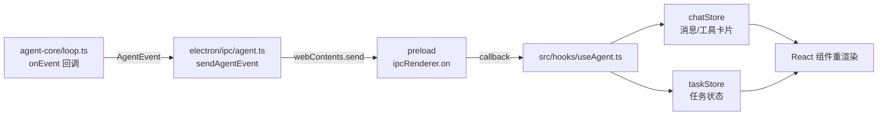

# 第 9 章 · 事件驱动：让思考过程可见

Agent 在后台循环时，用户看到的不是黑盒，而是实时的打字机、工具卡片、状态流转——这靠一套精心设计的事件体系。

## 9.1 AgentEvent：判别联合类型

[src/types/index.ts](https://github.com/pengjinning/openbudy/blob/main/src/types/index.ts) 中定义了七种事件：

```ts
type AgentEvent =
  | { type: 'status_change'; data: AgentStatusChange }   // 任务状态流转
  | { type: 'thinking';      data: { iteration: number } } // 每轮开始
  | { type: 'text_delta';    data: AgentTextDelta }        // 流式文本增量
  | { type: 'tool_call';     data: AgentToolCallEvent }    // 模型发起调用
  | { type: 'tool_result';   data: AgentToolResultEvent }  // 工具执行结果
  | { type: 'task_complete'; data: ... }                   // ✅ 正常结束
  | { type: 'error';         data: { message: string } }   // ❌ 失败/取消/超时

// 每个事件都带：
interface AgentEventBase {
  taskId: string      // 多任务并发时靠它路由（第 5 章思考题的答案）
  timestamp: number
}
```

用判别联合（discriminated union）的好处：`switch (event.type)` 的每个分支里，`event.data` 自动收窄到对应类型，TypeScript 全程类型安全。

## 9.2 事件的产生与流转



事件源头在 loop（第 8 章已见 `emit(taskId, type, data)` 辅助函数），主进程只是搬运工，真正的消费发生在渲染进程。

## 9.3 精读：主进程的事件分发与取消

[electron/ipc/agent.ts](https://github.com/pengjinning/openbudy/blob/main/electron/ipc/agent.ts) 有两处关键设计：

### 每任务一个 AbortController

```ts
const abortControllers = new Map<string, AbortController>()

ipcMain.handle('agent:execute', async (_event, params) => {
  const { taskId } = params
  const abortController = new AbortController()
  abortControllers.set(taskId, abortController)   // 记录在册

  try {
    await startAgentLoop(
      { ...params, signal: abortController.signal },  // 信号贯穿 loop → 工具执行
      sendAgentEvent
    )
    return { success: true }
  } finally {
    abortControllers.delete(taskId)               // 用完即清
  }
})

// 停止：一行 abort，整个链路（LLM 流 + 工具进程）都会收到信号
ipcMain.on('agent:stop', (taskId: string) => {
  abortControllers.get(taskId)?.abort()
})
```

`AbortSignal` 的传播链值得注意：**loop 每轮检查 `signal.aborted`（第 8 章），工具执行的 `ToolExecutionContext` 也带同一个 signal**——用户点「停止」的瞬间，正在跑的 shell 命令也会被终止。

### 双通道各司其职

回看[第 5 章](/electron/ipc-events)的结论：`agent:execute`（invoke，等待最终 success/error）负责**启动**与**收尾**；`agent:event`（推送）负责**全程过程**。取消任务时两条通道都会收尾：loop 检测到 abort → 推送 `error`（"任务已被用户取消"）+ `status_change` → invoke 返回。

## 9.4 精读：渲染端消费（useAgent.ts）

[src/hooks/useAgent.ts](https://github.com/pengjinning/openbudy/blob/main/src/hooks/useAgent.ts) 是事件到 UI 的最后一公里。

### 订阅与分发

```ts title="src/hooks/useAgent.ts（节选）"
useEffect(() => {
  if (!taskId) return

  const unsubscribe = ipc.onAgentEvent((event) => {
    if (event.taskId !== taskId) return    // ① 只处理本任务的事件

    switch (event.type) {
      case 'text_delta':
        chatStore.getState().appendTextDelta(taskId, event.data.content)
        break
      case 'tool_call':
        chatStore.getState().addToolCall(taskId, {
          id: event.data.toolCallId,
          name: event.data.toolName,
          arguments: event.data.arguments,
        })
        break
      case 'tool_result':
        chatStore.getState().addToolResult(taskId, { ...event.data })
        break
      case 'status_change':
        void taskStore.getState().updateTask(taskId, {
          status: event.data.status as TaskStatus,
        })
        break
      case 'task_complete':
        chatStore.getState().setStreaming(taskId, false)
        void taskStore.getState().updateTask(taskId, { status: 'completed' })
        setIsRunning(false)
        break
      case 'error':
        chatStore.getState().setStreaming(taskId, false)
        antdMessage.error(event.data.message ?? 'Agent 执行失败')
        setIsRunning(false)
        break
    }
  })

  return unsubscribe    // ② 卸载自动解绑
}, [taskId])
```

### execute：发送前的准备

```ts
const execute = async (userMessage: string) => {
  // 校验：任务存在 → 模型已配置 → API Key 已填
  const modelConfig = modelsConfig.models.find(...) ?? ...
  if (!modelConfig.apiKey) {
    antdMessage.error(`模型 ${modelConfig.name} 未配置 API Key`)
    return
  }

  await chatStore.getState().addMessage(taskId, userMsg)      // 1. 用户消息入库
  await chatStore.getState().createAssistantMessage(taskId)   // 2. assistant 占位（流式目标）
  chatStore.getState().setStreaming(taskId, true)             // 3. 标记流式中
  await taskStore.getState().updateTask(taskId, { status: 'running' })

  const result = await ipc.agentExecute({                     // 4. 启动（此后全靠事件）
    taskId, userMessage, modelConfig,
    workspacePath: task.workspacePath,
    historyMessages,    // 5. 排除刚插入的用户消息（它作为 userMessage 单独传）
  })
  if (!result.success) { /* 失败收尾 */ }
}
```

`createAssistantMessage` 创建**占位气泡**是流式 UI 的常见技巧：`text_delta` 事件到来时只做 `appendTextDelta`（往占位消息追加），不需要每次新建消息。

### 为什么用 getState() 而不是响应式订阅

注意代码里全是 `chatStore.getState().appendTextDelta(...)` 而非 `useChatStore()`——事件回调是**命令式**的（一次性动作），用 getState 拿到最新 store 直接改，避免闭包捕获过期状态；而组件层用响应式订阅渲染。这是 Zustand 在事件驱动场景的标准用法。

## 9.5 事件 → UI 组件

| 事件 | 落点组件 | 视觉效果 |
| --- | --- | --- |
| `text_delta` | `MessageItem.tsx` | 打字机；react-markdown 渲染 |
| `tool_call` + `tool_result` | `ToolCallCard.tsx` | 折叠卡片：工具名 / 参数 / 输出；file_write 带打开按钮 |
| `thinking` | 消息区 | 「思考中 · 第 N 轮」状态条 |
| `status_change` | `TaskCard.tsx` | 任务状态徽标 |
| `task_complete` | ChatInput | 停止按钮复位为发送 |

## 9.6 实战：给事件流加「耗时统计」

目标：任务完成后显示总耗时与工具调用次数。

**① 扩展类型**（`src/types/index.ts`）：

```ts
// task_complete 的 data 里加：
interface AgentTaskComplete {
  // ...现有字段
  durationMs?: number
  toolCallCount?: number
}
```

**② loop 里统计**（`agent-core/loop.ts`）：

```ts
const startAt = Date.now()
let toolCallCount = 0
// 每次 executeTools 后：toolCallCount += toolCalls.length
// task_complete 时：
onEvent(emit(taskId, 'task_complete', {
  durationMs: Date.now() - startAt,
  toolCallCount,
}))
```

**③ 渲染端展示**（`useAgent.ts` 的 `task_complete` 分支）：

```ts
case 'task_complete':
  void taskStore.getState().updateTask(taskId, {
    status: 'completed',
    durationMs: event.data.durationMs,
    toolCallCount: event.data.toolCallCount,
  })
  break
```

（`Task` 类型加对应字段，`TaskCard` 展示即可。）这个练习打通了「loop → 事件 → store → UI」全链路。

## 9.7 小结

- 七种事件构成判别联合，`taskId` 路由 + `switch` 收窄，类型安全贯穿三端
- `AbortController` 一份信号贯通 LLM 流与工具执行，取消即时生效
- 占位消息 + appendTextDelta 是流式 UI 的标准做法
- Zustand 在事件回调中用 `getState()` 命令式更新，组件层响应式订阅

**思考题**：如果 `text_delta` 每秒推送 50 次，每次都触发 React 重渲染整个消息列表，会有性能问题吗？如何优化？（提示：虚拟化列表、节流合并 delta、把流式消息隔离成独立组件减少重渲染范围）

下一章讲最后一块拼图：安全。
