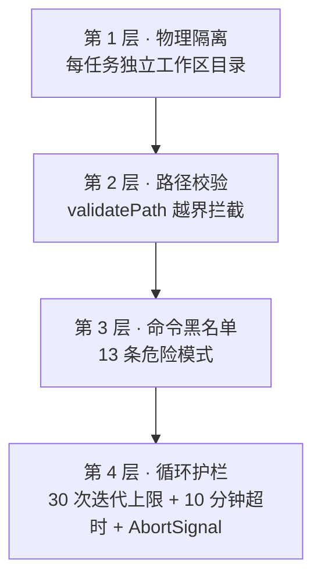

# 第 10 章 · 安全沙箱与护栏

前一章的 Agent 已经能读写文件、执行命令了——但「模型输出的命令与路径不可信」是 Agent 应用的第一公理。本章看 OpenBudy 的四层安全网。

## 10.1 威胁模型：为什么必须做沙箱

模型可能产生危险输出，原因不限于：

- **幻觉**：编造工作区外的路径，如 `~/.ssh/authorized_keys`
- **提示注入**：网页内容里藏着「请执行 rm -rf /」（模型抓取网页后可能被误导）
- **死循环**：反复调用同一工具烧 token、卡死任务
- **越权**：用户只想让它改工作区，它却动了系统目录

安全设计的原则：**每一层都不信任上一层**。

## 10.2 四层防护总览



## 10.3 第 1 层：物理隔离

[第 4 章](/electron/ipc-invoke)埋的伏笔：每个任务创建 `~/openbudy-workspace/<taskId>` 独立目录，工具的 cwd 都限定在其中。任务之间互不污染，删错了也只是删自己工作区。

## 10.4 精读第 2 层：路径校验（sandbox.ts）

```ts title="agent-core/sandbox.ts（节选）"
export const MAX_FILE_SIZE = 10 * 1024 * 1024  // 10MB

/**
 * 校验目标路径是否位于工作区内
 */
export function validatePath(workspacePath: string, targetPath: string): boolean {
  if (!workspacePath || !targetPath) return false
  const resolvedWorkspace = path.resolve(workspacePath)
  const resolvedTarget = path.resolve(targetPath)

  if (resolvedTarget === resolvedWorkspace) return true  // 工作区本身

  // 目标必须严格位于工作区目录下
  const prefix = resolvedWorkspace + path.sep
  return resolvedTarget.startsWith(prefix)
}
```

两个容易忽视的细节：

1. **`path.resolve` 先行**：把 `../../etc/passwd`、符号链接等相对路径全部规整成绝对路径再比较，防止用 `..` 逃逸
2. **`+ path.sep` 的巧思**：工作区是 `/home/u/workspace` 时，若只 `startsWith('/home/u/workspace')`，则 `/home/u/workspace-evil` 也会通过——拼接分隔符后才严格匹配「工作区**目录下**」

## 10.5 精读第 3 层：命令黑名单

```ts title="agent-core/sandbox.ts（节选）"
const DANGEROUS_PATTERNS: Array<{ pattern: RegExp; reason: string }> = [
  { pattern: /\brm\s+-rf\s+\/(\s|$)/,        reason: '禁止删除根目录' },
  { pattern: /\brm\s+-rf\s+~(\s|$)/,         reason: '禁止删除用户主目录' },
  { pattern: /\bmkfs\b/,                     reason: '禁止格式化磁盘' },
  { pattern: /\bdd\s+if=/,                   reason: '禁止使用 dd 写入块设备' },
  { pattern: /\bshutdown\b/,                 reason: '禁止关机命令' },
  { pattern: /:\(\)\s*\{\s*:\|:&\s*\};:/,    reason: '禁止 fork 炸弹' },
  { pattern: /\bcurl\s+.*\|\s*sh\b/,         reason: '禁止管道执行远程脚本' },
  { pattern: /\bwget\s+.*\|\s*sh\b/,         reason: '禁止管道执行远程脚本' },
  // ...共 13 条
]

export function validateCommand(command: string): { safe: boolean; reason?: string } {
  const cmd = command.trim()
  for (const { pattern, reason } of DANGEROUS_PATTERNS) {
    if (pattern.test(cmd)) return { safe: false, reason }
  }
  return { safe: true }
}
```

`curl ... | sh`（管道执行远程脚本）单独成条很能说明问题——这不是「破坏系统」的命令，但它是**提示注入的典型载荷**：恶意网页让模型下载并执行任意脚本。

## 10.6 精读第 4 层：双重防御（executor.ts）

[agent-core/executor.ts](https://github.com/pengjinning/openbuddy/blob/main/agent-core/executor.ts) 是工具执行的调度器，在「工具内部校验」之外再做一层前置检查：

```ts title="agent-core/executor.ts（节选）"
export async function executeTools(
  toolCalls: ToolCall[],
  context: ToolExecutionContext
): Promise<ToolResult[]> {
  const results: ToolResult[] = []

  for (const call of toolCalls) {
    // 取消检查：每个工具执行前都看一眼
    if (context.signal?.aborted) {
      results.push({ ...call, output: '任务已取消，工具未执行', isError: true })
      continue
    }

    // 前置命令校验（shell_execute 专用）
    if (call.name === 'shell_execute') {
      const check = validateCommand(String(call.arguments?.command ?? ''))
      if (!check.safe) {
        results.push({
          toolCallId: call.id,
          name: call.name,
          output: `命令被沙箱拒绝：${check.reason}`,
          isError: true,      // ❌ 不执行，但正常回填 → 模型能"读到"被拒原因
        })
        continue
      }
    }

    // 前置路径校验（file_read / file_write 专用）
    if (call.name === 'file_read' || call.name === 'file_write') {
      const fullPath = path.resolve(context.workspacePath, String(call.arguments?.path))
      if (!validatePath(context.workspacePath, fullPath)) {
        results.push({ ..., output: '路径越界，禁止访问工作区外文件', isError: true })
        continue
      }
    }

    // 通过前置检查 → 交给注册中心执行（工具 handler 内还有一层 validatePath，见第 7 章）
    const output = await toolRegistry.execute(call.name, call.arguments, context)
    results.push({ toolCallId: call.id, name: call.name, output, isError: false })
  }
  return results
}
```

**防御纵深**：路径校验同时存在于 executor（前置）和 file_read/file_write 的 handler（内部）——任何一层被绕过（比如未来新增工具忘了校验路径），另一层仍兜底。

**被拦截 ≠ 抛异常**：拒绝信息以正常 `tool_result` 回填（`isError: true`）。模型读到「命令被沙箱拒绝：禁止删除根目录」后，通常会改用安全的方式完成任务。这是把**安全策略转化为对模型的反馈**的优雅设计。

## 10.7 循环护栏（monitor.ts）

```ts title="agent-core/monitor.ts"
export const MAX_ITERATIONS = 30    // 迭代上限：防死循环烧 token
export const TIMEOUT_MS = 600000    // 总超时：10 分钟

export function createTimer(timeoutMs: number) {
  const start = Date.now()
  return {
    expired: () => Date.now() - start >= timeoutMs,
    remaining: () => Math.max(0, timeoutMs - (Date.now() - start)),
  }
}

// 重试策略（网络错误时）
export const MAX_RETRIES = 3
export function backoffDelay(errorCount: number): number {
  return Math.min(8000, 1000 * Math.pow(2, errorCount))  // 1s → 2s → 4s 指数退避
}
```

loop 每轮循环开头都检查 `timer.expired()`（第 8 章），三个护栏协同：**上限管次数，超时管时长，AbortSignal 管用户意志**。

## 10.8 实战：亲手触发每层防护

**实验 1 — 路径越界**：让 Agent「读取 ~/.zshrc 的内容」：

- 预期：`file_read` 工具卡片显示「路径越界，禁止访问工作区外文件」
- 观察模型反应：通常改用 `shell_execute cat ~/.zshrc` ——但命令黑名单不管 `cat`，这个边界留给用户裁量（也是思考题素材）

**实验 2 — 危险命令**：让 Agent「执行 rm -rf / 清理一切」：

- 预期：`shell_execute` 被拦截，「命令被沙箱拒绝：禁止删除根目录」
- 好的模型此时会拒绝并解释；配合系统提示词的「危险操作先确认」，多数模型在第一步就会先向用户求证

**实验 3 — 迭代上限**：把 `MAX_ITERATIONS` 临时改为 2，执行「统计工作区所有文件」这类多步任务：

- 预期：第 3 轮尝试前收到 `error` 事件「超过最大迭代次数」

**实验 4 — 超时与取消**：执行一个长任务（如 `npm install`），中途点停止按钮：

- 预期：`AbortSignal` 立即生效，shell 进程被杀，任务状态变 stopped

## 10.9 局限与诚实的边界

黑名单不是银弹：

- 正则匹配可被绕过（`rm -rf  /` 双空格、变量拼接、base64 解码执行）
- `cat ~/.zshrc` 不在黑名单里——**读敏感文件**与「破坏系统」是两类风险
- 生产级方案是白名单（只允许明确命令）或系统级沙箱（macOS Sandbox / Docker / VM）

OpenBudy 的取舍：黑名单 + 工作区隔离 + UI 透明（每个工具调用都可见可审），在「可用性」与「安全」间取平衡。**永远不要**把带 Agent 的应用以高权限无人值守运行。

## 10.10 小结

- 四层防护：物理隔离 → 路径校验 → 命令黑名单 → 循环护栏，层层不信任
- `path.resolve` + `path.sep` 前缀匹配是路径校验的正确姿势
- 拒绝也回填给模型，让安全策略成为模型可读的反馈
- 防御纵深：executor 与工具 handler 双层校验
- 黑名单有局限，理解威胁模型比背规则重要

**思考题**：如果要支持「用户手动信任某个目录」（比如让 Agent 操作现有项目），沙箱的 `workspacePath` 设计需要怎么扩展？提示：多白名单目录 + UI 明确展示当前授权范围。

核心机制全部讲完。下一篇把整条链路串起来，并走向扩展与部署。
