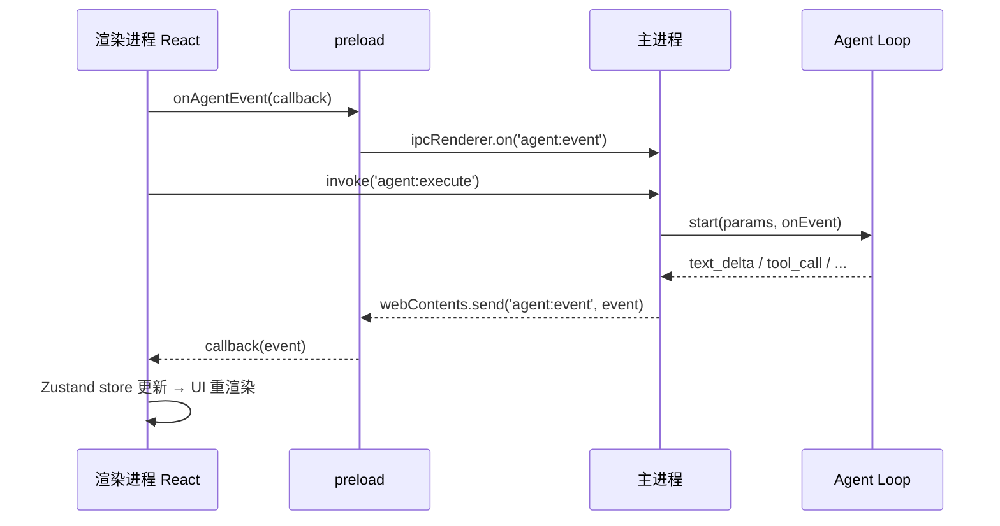

# 第 5 章 · IPC 通信（二）：事件推送模式

## 5.1 为什么需要事件推送

Agent 回复一个长答案时，LLM 是**逐 token 流式输出**的。如果等全部生成完再一次性返回，用户要盯着空白界面等十几秒。

体验上正确的做法：主进程每收到一个 chunk，就立刻推给渲染进程，页面边收边渲染。这要求 **主进程 → 渲染进程的主动推送**：

```
webContents.send('agent:event', event)   // 主进程发
ipcRenderer.on('agent:event', handler)   // preload 收，转发给页面
```

## 5.2 推送的完整链路



注意关键设计：**`agent:execute`（invoke）和 `agent:event`（推送）是两条独立通道**。invoke 只负责「启动并等待最终结果」，所有中间过程都走事件通道。这是流式任务的标准架构。

## 5.3 精读：主进程如何发送（electron/ipc/agent.ts）

```ts title="electron/ipc/agent.ts（节选）"
import { ipcMain, BrowserWindow } from 'electron'

function getMainWindow(): BrowserWindow | null {
  const windows = BrowserWindow.getAllWindows()
  return windows[0] || null
}

// 所有 Agent 事件都经此函数推送
function sendAgentEvent(event: AgentEvent) {
  const win = getMainWindow()
  if (win && !win.isDestroyed()) {
    win.webContents.send('agent:event', event)
  }
}

ipcMain.handle('agent:execute', async (_event, params) => {
  // ...参数解析后
  await startAgentLoop({ ...params, signal: abortController.signal }, sendAgentEvent)
  return { success: true }
})
```

`AgentLoop.start` 接受一个 `onEvent` 回调——**Loop 本身不知道 Electron 的存在**，它只管吐事件；把事件转发到哪个窗口是主进程的事。又一次看到了 `agent-core` 与宿主的解耦。

细节：`win.isDestroyed()` 检查不可省——用户可能在任务执行中关掉窗口。

## 5.4 精读：preload 的事件订阅（electron/preload.ts）

```ts
onAgentEvent: (callback) => {
  const handler = (_event: Electron.IpcRendererEvent, data: unknown) => callback(data)
  ipcRenderer.on('agent:event', handler)
  // 返回取消订阅函数 —— React useEffect cleanup 必需
  return () => ipcRenderer.removeListener('agent:event', handler)
}
```

返回取消订阅函数是 React 世界的关键约定，配合 `useEffect` 的 cleanup 使用：

```ts
useEffect(() => {
  const unsubscribe = ipc.onAgentEvent(handleEvent)
  return unsubscribe   // 组件卸载 / taskId 变化时自动解绑
}, [taskId])
```

## 5.5 渲染端封装：src/services/ipc.ts

渲染进程不直接碰 `window.electronAPI`，而是经过一层统一封装：

```ts title="src/services/ipc.ts（核心思路）"
import type { AgentEvent, ModelConfig } from '../types'

interface ElectronAPI { /* 与 preload 一致的接口 */ }

declare global {
  interface Window {
    electronAPI?: ElectronAPI
  }
}

function detectEnv(): 'electron' | 'browser' {
  return typeof window !== 'undefined' && window.electronAPI
    ? 'electron'
    : 'browser'
}
```

这层封装做三件事：

1. **类型收窄**：把 `unknown` 事件转成判别联合类型 `AgentEvent`
2. **环境探测**：`window.electronAPI` 存在 → Electron；否则 → 浏览器
3. **Mock 分流**：浏览器环境下自动切换到 Mock 实现

## 5.6 浏览器 Mock 模式

`pnpm dev`（纯浏览器，没有 Electron）时，`ipc.ts` 会用一套 Mock 实现替换所有 IPC 调用：

```ts title="src/services/ipc.ts（Mock 实现节选）"
const MOCK_FILE_LIST = [
  { name: 'src', path: '/mock/src', isDirectory: true, size: 0 },
  { name: 'README.md', path: '/mock/README.md', isDirectory: false, size: 1024 },
]

function mockAgentExecute(params: { taskId: string; userMessage: string }) {
  // 按时间线模拟完整事件序列：
  // status_change → text_delta(×2) → tool_call → tool_result → task_complete
  const events = [
    { type: 'status_change', data: { status: 'running' }, delay: 100 },
    { type: 'text_delta', data: { content: `收到指令："${params.userMessage}"` }, delay: 400 },
    { type: 'tool_call', data: { toolName: 'file_write', arguments: { path: 'demo/hello.md' } }, delay: 1200 },
    { type: 'tool_result', data: { output: '已写入文件' }, delay: 1600 },
    // ...
  ]
  // 通过 window.dispatchEvent(new CustomEvent('mock-agent-event', ...)) 派发
}
```

这带来一个非常重要的工程收益：**UI 开发完全不依赖 Electron 和真实 API Key**。`onAgentEvent` 在浏览器模式下监听的是 `mock-agent-event` 自定义事件，对上层代码完全透明——`useAgent` 不需要知道自己处于哪个环境。

:::tip 这是「适配器模式」的经典应用
`ipc` 对象是稳定接口，Electron 实现与 Mock 实现是可互换的两个适配器。你还可以加第三个：Web 版远程 Agent 服务。
:::

## 5.7 渲染端消费：useAgent Hook 一瞥

事件到达渲染进程后如何变成 UI？先看个轮廓（细节在[第 9 章](/agent-loop/events)展开）：

```ts title="src/hooks/useAgent.ts（节选）"
useEffect(() => {
  const unsubscribe = ipc.onAgentEvent((event) => {
    if (event.taskId !== taskId) return   // 只处理当前任务的事件

    switch (event.type) {
      case 'text_delta':       // 流式文本 → 追加到正在生成的消息
        chatStore.getState().appendTextDelta(taskId, event.data.content)
        break
      case 'tool_call':        // 工具调用 → 插入工具卡片
        chatStore.getState().addToolCall(taskId, { ... })
        break
      case 'status_change':    // 状态 → 更新任务状态
        taskStore.getState().updateTask(taskId, { status: event.data.status })
        break
      case 'task_complete':
        chatStore.getState().setStreaming(taskId, false)
        break
    }
  })
  return unsubscribe
}, [taskId])
```

## 5.8 实战：主进程每秒推送计数

在主进程加一个测试通道（仅练习用）：

```ts
// electron/ipc/app.ts
ipcMain.handle('app:startTicker', () => {
  const win = BrowserWindow.getAllWindows()[0]
  let count = 0
  const timer = setInterval(() => {
    count += 1
    win?.webContents.send('app:tick', { count, at: Date.now() })
    if (count >= 10) clearInterval(timer)
  }, 1000)
})
```

preload 暴露：

```ts
startTicker: () => ipcRenderer.invoke('app:startTicker'),
onTick: (cb: (data: { count: number; at: number }) => void) => {
  const handler = (_e: unknown, data: { count: number; at: number }) => cb(data)
  ipcRenderer.on('app:tick', handler)
  return () => ipcRenderer.removeListener('app:tick', handler)
},
```

页面消费：

```tsx
const [count, setCount] = useState(0)
useEffect(() => ipc.onTick((d) => setCount(d.count)), [])
```

跑起来，你会看到数字每秒 +1，直到 10——这就是 Agent 流式输出的最小原型。

:::warning 练习后记得清理
这个 ticker 会一直持有窗口引用，生产代码别忘了 `win.isDestroyed()` 检查与定时器清理。
:::

## 5.9 小结

- 流式场景 = `invoke` 启动任务 + `webContents.send` 推送过程事件，双通道配合
- 事件订阅必须提供取消函数，防监听器泄漏
- `src/services/ipc.ts` 的适配器层让「Electron / 浏览器 Mock」无缝切换
- `agent-core` 只吐事件回调，不感知 Electron —— 可移植性的来源

**思考题**：如果两个任务同时执行，两个任务的事件都从 `agent:event` 通道推送，渲染进程如何区分？（提示：看 `AgentEvent.taskId` 字段与 `useAgent` 里的过滤）

Electron 基础到此打住。下一篇进入 Agent 的核心：先搞懂 LLM API 与 pi-ai。
