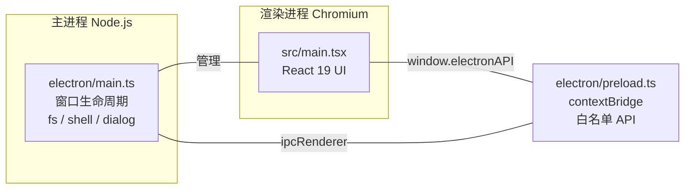

# 第 3 章 · Electron 进程模型与窗口

## 3.1 三个角色

Electron 应用由三类进程/脚本协作：



| 角色 | 运行环境 | 能做 | 不能做 |
| --- | --- | --- | --- |
| **主进程** | Node.js | 创建窗口、读写文件、执行 shell、系统对话框 | 直接操作页面 DOM |
| **渲染进程** | Chromium | React UI、DOM | （默认）无法访问 Node API、无法直接读写文件 |
| **preload** | 两者之间的桥 | 通过 `contextBridge` 暴露白名单 API | 不应暴露任意 `ipcRenderer` |

## 3.2 为什么不直接 `nodeIntegration: true`

最省事的做法是让渲染进程直接跑 Node：`nodeIntegration: true`。但这意味着**页面里任何一段脚本**（包括被 XSS 注入的第三方脚本、甚至模型生成的 HTML 预览）都能执行 `require('child_process')`——对 Agent 这种「会执行模型输出内容」的应用，等于把家门钥匙交给 LLM。

Electron 官方推荐的安全基线（OpenBudy 全部遵循）：

- `nodeIntegration: false` —— 渲染进程无 Node
- `contextIsolation: true` —— preload 与页面环境隔离
- 通过 `contextBridge.exposeInMainWorld` 只暴露**显式声明**的方法

## 3.3 精读 electron/main.ts

```ts title="electron/main.ts（节选）"
import { app, BrowserWindow, session } from 'electron'
import path from 'path'
import { registerAgentIpc } from './ipc/agent'
import { registerFileIpc } from './ipc/file'
import { registerStorageIpc } from './ipc/storage'

let mainWindow: BrowserWindow | null = null

const devServerUrl = process.env.VITE_DEV_SERVER_URL

function createWindow() {
  mainWindow = new BrowserWindow({
    width: 1400,
    height: 900,
    minWidth: 1000,
    minHeight: 600,
    title: 'OpenBudy',
    webPreferences: {
      preload: path.join(__dirname, 'preload.js'), // 桥接脚本
      nodeIntegration: false,                      // 渲染进程禁用 Node
      contextIsolation: true,                      // 隔离 preload 与页面
      sandbox: false,
    },
    titleBarStyle: 'hiddenInset',                  // macOS 沉浸式标题栏
    backgroundColor: '#ffffff',
  })

  if (process.env.VITE_DEV_SERVER_URL) {
    // 开发模式：加载 Vite Dev Server，享受 HMR
    mainWindow.loadURL(process.env.VITE_DEV_SERVER_URL)
    mainWindow.webContents.openDevTools()
  } else {
    // 生产模式：加载打包后的静态文件
    mainWindow.loadFile(path.join(__dirname, '../dist/index.html'))
  }

  mainWindow.on('closed', () => {
    mainWindow = null
  })
}

app.whenReady().then(() => {
  installContentSecurityPolicy()
  registerAgentIpc()    // Agent 执行 / 停止（第 9 章）
  registerFileIpc()     // 文件读写（第 4 章）
  registerStorageIpc()  // 配置读写（第 4 章）
  createWindow()
})
```

几个值得注意的细节：

1. **IPC 注册集中在 `app.whenReady()`**：三组通道各自一个 `register*Ipc()` 函数，主文件保持整洁。
2. **双模式加载**：开发时用 `VITE_DEV_SERVER_URL`，生产时 `loadFile`，这正是 `vite-plugin-electron` 的用法。
3. **CSP（内容安全策略）**：OpenBudy 在 `session.defaultSession.webRequest.onHeadersReceived` 里给应用文档注入了 CSP——`script-src 'self' 'unsafe-inline' https://cdn.jsdelivr.net`。注意它刻意**不包含** `unsafe-eval`，因为 Electron 的安全告警会检查它。

## 3.4 Vite 是如何同时构建两端的

看一眼 `vite.config.ts` 的核心思路（简化）：

```ts
import electron from 'vite-plugin-electron'

export default defineConfig({
  plugins: [
    react(),
    electron([
      {
        entry: 'electron/main.ts',
        vite: {
          build: {
            outDir: 'dist-electron',   // 主进程产物
            rollupOptions: { input: { preload: 'electron/preload.ts' } },
          },
        },
      },
    ]),
  ],
})
```

- 渲染进程（`src/`）→ 普通 Vite 构建 → `dist/`
- 主进程 + preload（`electron/`）→ `vite-plugin-electron` 构建 → `dist-electron/`
- `package.json` 的 `main` 字段指向 `dist-electron/main.js`，Electron 由此启动主进程

## 3.5 实战：观察进程隔离

1. `pnpm electron:dev` 启动应用（会自动打开 DevTools）
2. 在 DevTools Console 输入：

```js
// ✅ preload 暴露的白名单 API 存在
typeof window.electronAPI          // "object"

// ❌ Node 能力不可见 —— 安全隔离生效
typeof require                     // "undefined"
typeof process                     // "undefined"
```

3. 再试试调用一个真实通道：

```js
await window.electronAPI.storageGet('not-exist-key')  // null（走完整个 IPC 往返）
```

## 3.6 小结

- 主进程（Node）/ 渲染进程（Chromium）/ preload（桥）三权分立
- `nodeIntegration: false` + `contextIsolation: true` 是 Agent 应用的安全底线
- `vite-plugin-electron` 让两端共享一套 Vite 工程配置

**思考题**：如果未来要支持「渲染进程直接读剪贴板」，应该在渲染进程加权限，还是走 preload → 主进程 IPC？为什么？

下一章，我们打通第一座桥：请求-响应式 IPC。
