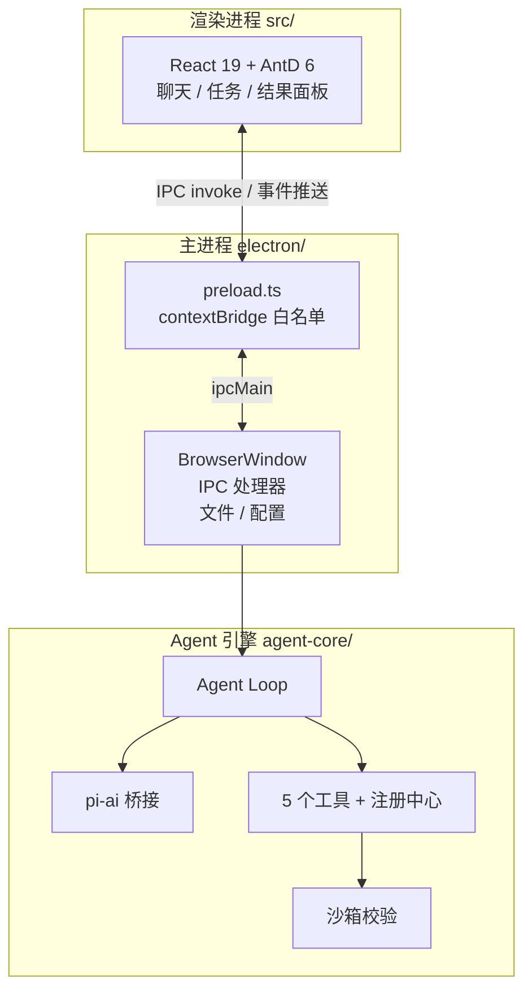

# 第 2 章 · 项目架构与开发环境

## 2.1 三大模块

OpenBudy 按职责拆成三个顶层目录，也是本教程的三大主线：



| 模块 | 目录 | 职责 | 对应篇章 |
| --- | --- | --- | --- |
| 渲染进程 | `src/` | React UI：任务列表、聊天流、工具卡片、文件树 / Diff | 第二篇 |
| Electron 主进程 | `electron/` | 窗口管理、IPC 通道、文件与配置读写 | 第二篇 |
| Agent 引擎 | `agent-core/` | LLM 调用、工具执行、循环控制、沙箱 | 第三、四篇 |

:::info 为什么 agent-core 不放进 electron/
`agent-core` 是纯 Node 逻辑，不依赖任何 Electron API——LLM 调用、工具、循环都可以脱离窗口独立测试。Electron 主进程只是它的「宿主」。这个解耦让你以后可以把它搬到 CLI、VS Code 插件甚至服务端。
:::

## 2.2 技术栈速览

| 层级 | 技术 |
| --- | --- |
| 桌面框架 | Electron 30 |
| 前端 | React 19 + TypeScript 5 + Ant Design 6 |
| 状态管理 | Zustand 4 |
| 构建 | Vite 5 + vite-plugin-electron |
| 本地存储 | IndexedDB（Dexie.js 4） |
| 代码 / Diff | Monaco Editor |
| AI 客户端 | `@earendil-works/pi-ai`（智谱 / DeepSeek 等 OpenAI 兼容流式） |
| 打包 | electron-builder |

## 2.3 实战：把项目跑起来

### 环境要求

- **Node.js ≥ 22.19**（pi-ai 的运行时要求，项目 `.nvmrc` 已锁定）
- **pnpm**（推荐）

### 步骤

```bash
# 1. 克隆仓库
git clone https://github.com/pengjinning/openbudy.git
cd openbudy

# 2. 安装依赖
pnpm install

# 3. 浏览器模式（纯 UI 调试，无需 Electron，内置 Mock 数据）
pnpm dev

# 4. Electron 桌面应用（完整体验）
pnpm electron:dev
```

:::tip 两种开发模式
- `pnpm dev`：纯浏览器，`src/services/ipc.ts` 会自动切换到 **Mock 实现**（详见[第 5 章](/electron/ipc-events)），不接真模型也能调 UI。
- `pnpm electron:dev`：启动 Vite Dev Server + Electron 主进程，加载 `VITE_DEV_SERVER_URL`。
:::

### 配置模型 API Key

1. 启动应用后打开 **设置**
2. 填入 [智谱开放平台](https://open.bigmodel.cn/usercenter/apikeys) 的 API Key（内置 GLM-4.5-Flash 免费模型预设）
3. 也可在 **模型管理** 添加 DeepSeek 等 OpenAI 兼容服务

Key 只保存在本地 `~/.openbudy/config.json`，通过主进程 IPC 读写，**永远不会进入渲染进程的构建产物**（安全设计见[第 4 章](/electron/ipc-invoke)）。

### 验证 Agent

创建一个任务，输入：

> 在工作区创建 hello.md，内容是"# Hello OpenBudy"

预期现象：

1. 聊天流中出现模型回复（流式打字效果）
2. 出现 `file_write` 工具调用卡片
3. 右侧文件树出现 `hello.md`

如果三步都出现了——恭喜，你已经亲眼见过完整的 Agent Loop。

## 2.4 关键目录导览

```
openbudy/
├── electron/
│   ├── main.ts          # 主进程入口：窗口 + CSP + IPC 注册
│   ├── preload.ts       # contextBridge 白名单桥接
│   └── ipc/             # agent / file / storage 三组 IPC
├── src/
│   ├── services/ipc.ts  # ElectronAPI 封装 + 浏览器 Mock
│   ├── hooks/useAgent.ts # 订阅 Agent 事件 → 更新 store
│   ├── stores/          # Zustand：task / chat / result / settings
│   └── components/      # layout / task / chat / result
└── agent-core/
    ├── loop.ts          # Agent Loop 主控制器
    ├── llm/pi-ai.ts     # pi-ai 桥接层 + 智谱预设
    ├── tools/           # 5 个工具 + registry
    ├── executor.ts      # 工具调度 + 沙箱前置校验
    ├── sandbox.ts       # 路径 / 命令校验
    ├── planner.ts       # 系统提示词
    └── monitor.ts       # 迭代上限 / 超时 / 重试
```

## 2.5 小结

- 三模块分层：`src`（UI）/ `electron`（宿主）/ `agent-core`（引擎），职责清晰可替换
- `pnpm dev` 走 Mock、`pnpm electron:dev` 走真 IPC，双模式开发
- API Key 经主进程存本地文件，不进渲染进程

**思考题**：如果把 `agent-core` 合并进 `electron/` 目录，会失去什么能力？

下一步，我们进入第二篇，先从 Electron 的进程模型讲起。
