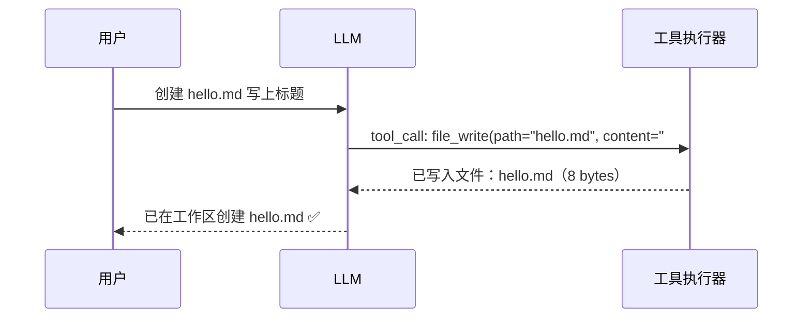
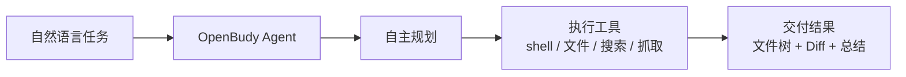

# 第 1 章 · 什么是 AI Agent

## 1.1 从 Chatbot 到 Agent

你已经很熟悉 Chatbot 了：发一句话，模型回一段文字，对话结束。模型的输出**只是一段文本**——它不能读你磁盘上的文件，不能跑一条命令，更不能交付一个结果给你。

**Agent（智能体）的本质，是给 LLM 装上「手」和「脚」：**

| 能力 | Chatbot | Agent |
| --- | --- | --- |
| 对话 | ✅ | ✅ |
| 读文件 / 写文件 | ❌ | ✅ 通过工具 |
| 执行 shell 命令 | ❌ | ✅ 通过工具 |
| 联网搜索 / 抓网页 | ❌ | ✅ 通过工具 |
| **自主决定下一步做什么** | ❌ | ✅ Agent Loop |

一句话概括：

> **Agent = LLM + 工具调用（Tool Calling）+ 循环（Agent Loop）**

模型负责「思考与决策」，宿主程序负责「执行」，两者在循环中反复交互，直到任务完成。

## 1.2 一个最小的 Agent 执行流程

假设用户说：「帮我在工作区创建一个 hello.md，写上标题」。

注意两个关键点：

1. **模型不执行代码**。它只是输出一段结构化的「调用请求」（`file_write` + 参数），真正写文件的是你的 TypeScript 程序。
2. **执行结果要回填给模型**。模型看到工具结果后，才能决定「任务已完成，可以回复用户了」还是「结果不对，我换个方式再试」。

这个「调用 → 执行 → 回填 → 再思考」的循环，就是贯穿本教程的 **Agent Loop**。

## 1.3 OpenBudy：本教程的实战样本

[OpenBudy](https://github.com/pengjinning/openbudy) 是一个开源的 AI Agent 桌面工作台，用 TypeScript 全栈实现：

你只需用自然语言描述需求，它会自主规划、执行并交付完整结果。本教程不会纸上谈兵——**每一章讲的机制，都直接精读 OpenBudy 的真实源码**，并给出动手环节。

## 1.4 核心概念速览

后续章节会逐一展开这五个概念，这里先建立索引：

| 概念 | 一句话解释 | 详见 |
| --- | --- | --- |
| **LLM** | 大语言模型，通过 HTTP API 以「消息列表」方式调用 | [第 6 章](/llm/pi-ai) |
| **pi-ai** | 多 Provider 的 LLM SDK 抽象层，OpenBudy 用它对接智谱 GLM / DeepSeek | [第 6 章](/llm/pi-ai) |
| **Tools** | 宿主程序提供给模型的「手」：JSON Schema 声明 + TypeScript 实现 | [第 7 章](/tools/tool-calling) |
| **Agent Loop** | 思考 → 调工具 → 看结果 → 再思考的循环控制器 | [第 8 章](/agent-loop/) |
| **IPC** | Electron 主进程与渲染进程之间的通信桥梁，Agent 事件靠它推送 | [第 4、5 章](/electron/ipc-invoke) |
| **Sandbox** | 安全护栏：路径越界校验 + 危险命令黑名单 + 迭代上限 | [第 10 章](/agent-loop/sandbox) |

## 1.5 为什么选 Electron + TypeScript + pi-ai

- **Electron**：Agent 天然需要访问本地文件系统、执行 shell 命令——这些是浏览器做不到的。桌面端是 Agent 最自然的宿主形态。
- **TypeScript**：Agent 涉及大量结构化数据（消息、工具定义、事件），类型系统让协议在主进程、渲染进程、LLM SDK 之间保持一致。
- **pi-ai**：不同模型厂商（智谱、DeepSeek、OpenAI……）接口细节各异，pi-ai 提供统一的 `streamSimple` 流式抽象与模型目录，让你在厂商之间无痛切换。

## 1.6 小结

- Agent = LLM + 工具 + 循环；模型只「点菜」，宿主来「上菜」
- 工具结果必须回填给模型，循环才能继续
- OpenBudy 是完整、可运行的实战样本，本教程逐层拆解它

**思考题**：如果模型调用了 `file_read` 但文件不存在，Agent 应该怎么「感受」到失败？提示：把错误信息作为工具结果回填，也是一种有效反馈。（答案将在[第 8 章](/agent-loop/)揭晓）

下一章，我们把 OpenBudy 跑起来，看清它的三大模块。
