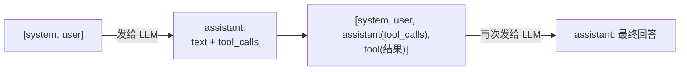

# 第 6 章 · LLM API 基础与 pi-ai

## 6.1 消息协议：四种 role

所有主流 LLM 的 Chat API 都围绕一个「消息列表」工作。以 OpenAI 兼容格式为例：

```ts
type LLMMessage =
  | { role: 'system'; content: string }          // 设定人设与规则
  | { role: 'user'; content: string }            // 用户输入
  | { role: 'assistant'; content: string; tool_calls?: ToolCall[] } // 模型回复（可带工具调用）
  | { role: 'tool'; content: string; tool_call_id: string }          // 工具执行结果
```

一轮完整交互的消息演变：



**关键认知**：LLM 是无状态的。所谓「多轮对话」，就是客户端每次都把完整历史发一遍。OpenBudy 的 [agent-core/loop.ts](https://github.com/pengjinning/openbudy/blob/main/agent-core/loop.ts) 中 `historyToLLMMessages` 函数干的就是这件事——把本地存储的历史消息还原成标准格式（详见[第 8 章](/agent-loop/)）。

## 6.2 流式输出：chunk 是什么

非流式调用要等全文生成完才返回；流式（`stream: true`）则通过 SSE 逐块推送：

```
data: {"choices":[{"delta":{"content":"你"}}]}
data: {"choices":[{"delta":{"content":"好"}}]}
data: {"choices":[{"delta":{"content":"！"},finish_reason":"stop"}]}
data: [DONE]
```

每个 chunk 只携带增量（`delta`）。客户端把增量拼起来就是完整回答，同时可以边收边渲染——这就是打字机效果的来源。工具调用也是流式的：`tool_calls` 的函数名和参数 JSON 会被拆成多个片段，需要拼接。

## 6.3 为什么需要 pi-ai

直接用 `fetch` 调 OpenAI 兼容接口完全可行，但你会很快遇到一堆脏活：

- 智谱 GLM-4.7 / GLM-5.3 是**推理模型**，思考流的格式与普通模型不同
- 各厂商的 baseURL 拼接规则、认证方式、参数名有细微差异
- 流式解析（含 tool_call 分片拼接）每家都要重写一遍

[`@earendil-works/pi-ai`](https://www.npmjs.com/package/@earendil-works/pi-ai) 的解法是提供：

| 抽象 | 说明 |
| --- | --- |
| `Model` | 一份模型定义：endpoint 类型、上下文长度、是否支持工具、推理模型兼容标记（如 `thinkingFormat: "zai"`） |
| 模型目录 | 内置 `zai` / `zai-coding-cn` / `deepseek` / `openai` 等厂商的模型清单 |
| `streamSimple` | 统一的流式调用入口，吐出标准化 chunk |

OpenBudy 用一个桥接层 [agent-core/llm/pi-ai.ts](https://github.com/pengjinning/openbudy/blob/main/agent-core/llm/pi-ai.ts) 把它接进来，对外保持自己的 `LLMMessage / LLMChunk` 协议——**loop.ts 完全不知道底层是 pi-ai**。

## 6.4 精读：ModelConfig 与预设

OpenBudy 的用户配置模型（存于 `~/.openbudy/config.json`，见[第 4 章](/electron/ipc-invoke)）：

```ts
interface ModelConfig {
  id: string            // 如 'glm-4.5-flash'
  name: string          // 展示名
  provider: string      // 'zhipu' | 'deepseek' | 自定义
  baseUrl: string       // OpenAI 兼容端点
  apiKey: string        // 主进程持有，不进渲染进程
  maxInputTokens: number
  maxOutputTokens: number
  supportsToolCalling: boolean
}
```

内置的智谱预设（节选）：

```ts title="agent-core/llm/pi-ai.ts（节选）"
export const ZHIPU_PRESETS: ModelConfig[] = [
  {
    id: 'glm-4.5-flash',
    name: 'GLM-4.5-Flash（免费）',
    provider: 'zhipu',
    baseUrl: 'https://open.bigmodel.cn/api/paas/v4',
    apiKey: '',
    maxInputTokens: 128000,
    maxOutputTokens: 4096,
    supportsToolCalling: true,
  },
  // glm-4.6 / glm-4.7 / glm-5.3 ...
]
```

## 6.5 精读：ModelConfig → pi-ai Model 的转换

这是桥接层的核心函数，处理三类情况：

```ts title="agent-core/llm/pi-ai.ts（逻辑简化）"
export function toPiModel(config: ModelConfig): Model<'openai-completions'> {
  const baseUrl = normalizeBaseUrl(config.baseUrl)

  // 1. 智谱：优先在官方目录中找同名模型，复用其兼容标记（thinkingFormat: "zai"），
  //    只覆盖 baseUrl —— 同时兼容开放平台与 Coding Plan 端点
  // 2. 目录中已有同名模型的厂商（deepseek 等）→ 直接复用 + 覆盖 baseUrl
  // 3. 未收录的自定义模型 → 按 openai-completions 兜底构造
}
```

一个容易被踩的坑被 `normalizeBaseUrl` 解决：

```ts
// 用户配置里可能存的是完整端点：
//   https://api.deepseek.com/v1/chat/completions
// OpenAI SDK 会自动拼 /chat/completions，必须去掉尾部，否则路径重复
function normalizeBaseUrl(url: string): string {
  return url.replace(/\/chat\/completions\/?$/i, '').replace(/\/+$/, '')
}
```

:::info 推理模型的思考流
GLM-4.7 / GLM-5.3 等「推理模型」会额外输出思考过程。pi-ai 目录中这些模型带有 `thinkingFormat: "zai"` 兼容标记，`streamSimple` 会正确解析思考流——这是 OpenBudy 优先复用官方模型目录、而不是全部手工构造的原因。
:::

## 6.6 精读：流式调用封装

桥接层最终暴露给 loop 的函数签名：

```ts
async function* chatStreamViaPiAi(
  messages: LLMMessage[],
  modelConfig: ModelConfig,
  tools: ToolDefinition[],
  signal?: AbortSignal
): AsyncGenerator<LLMChunk> {
  // 内部：
  // 1. toPiModel(modelConfig) 转换模型定义
  // 2. tools → pi-ai 的 Tool 格式（含 JSON Schema 参数 + execute 包装）
  // 3. streamSimple(context, model, messages, tools) 逐 chunk 吐出
  // 4. 归一化为 LLMChunk：
  //    { type: 'text', content } | { type: 'tool_call', toolCall } | { type: 'done', finishReason }
}
```

`LLMChunk` 是 OpenBudy 自己的判别联合——loop 只认识它，不认识 pi-ai 的类型。这就是**防腐层**（Anti-Corruption Layer）的价值：哪天换掉 pi-ai，loop 一行不改。

## 6.7 实战：30 行代码接通智谱 GLM

在仓库根目录新建 `scripts/try-llm.ts`（用 `npx tsx scripts/try-llm.ts` 运行）：

```ts
import { streamSimple } from '@earendil-works/pi-ai/api/openai-completions'

const apiKey = process.env.ZHIPU_API_KEY!  // export ZHIPU_API_KEY=xxx

const context = {
  apiKey,
  baseURL: 'https://open.bigmodel.cn/api/paas/v4',
}

const model = {
  // 简化定义；完整字段见 pi-ai 的 Model 类型
  endpoint: 'openai-completions',
  name: 'glm-4.5-flash',
  contextLimit: 128000,
  maxTokens: 4096,
} as any

async function main() {
  const stream = streamSimple(context, model, [
    { role: 'user', content: '用一句话介绍什么是 AI Agent' },
  ])

  for await (const chunk of stream) {
    if (chunk.type === 'text' && chunk.content) {
      process.stdout.write(chunk.content)   // 打字机效果！
    }
  }
}

main()
```

运行前先 `export ZHIPU_API_KEY=你的key`，然后：

```bash
npx tsx scripts/try-llm.ts
```

你会看到回答逐字打印出来——你已经亲手消费过 LLM 的流了。Agent Loop 做的事情，本质上就是在 `for await` 循环里多处理一种叫 `tool_call` 的 chunk。

## 6.8 小结

- 消息列表 + 四种 role 是所有 Chat API 的公共语言；LLM 无状态，历史靠客户端重放
- 流式 = 增量 chunk；工具调用的参数也是分片传输、需要拼接
- pi-ai 提供 Model 抽象 / 模型目录 / `streamSimple`，OpenBudy 用桥接层隔离它
- `normalizeBaseUrl` 与推理模型 `thinkingFormat` 是两个高频踩坑点

**思考题**：为什么 OpenBudy 要定义自己的 `LLMChunk`，而不是让 loop 直接消费 pi-ai 的原生事件类型？

下一章，给模型装上「手」：工具调用。
