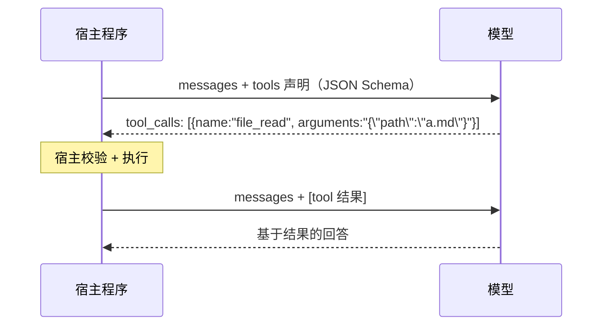

# 第 7 章 · 工具调用（Tools）

## 7.1 Function Calling 原理

Function Calling 常被误解为「模型执行了代码」。恰恰相反——**模型只输出一段 JSON 说"我想调用 X，参数是 Y"，执行永远发生在宿主程序**：



所以「给模型加工具」= 三件事：

1. **声明**：用 JSON Schema 描述工具名、用途、参数（模型据此决定能否用、怎么用）
2. **执行**：宿主程序真正干活
3. **回填**：把结果作为 `role: 'tool'` 消息发回模型

## 7.2 OpenBudy 的工具三要素

在 [src/types/index.ts](https://github.com/pengjinning/openbudy/blob/main/src/types/index.ts) 中定义：

```ts
// 1. 声明：给模型看的 JSON Schema（OpenAI function 格式）
interface ToolDefinition {
  type: 'function'
  function: {
    name: string
    description: string
    parameters: Record<string, unknown>  // JSON Schema
  }
}

// 2. 执行上下文：每个工具执行时都能拿到
interface ToolExecutionContext {
  workspacePath: string
  signal?: AbortSignal   // 用户点停止 → abort
}

// 3. 处理器：真正干活的函数
type ToolHandler = (
  args: Record<string, unknown>,
  context: ToolExecutionContext
) => Promise<string>   // 返回字符串（模型只认识文本）
```

注意 `ToolHandler` 返回的是 **string 而非对象**——工具输出最终会成为 `role: 'tool'` 消息的 content。结构化数据应自己 `JSON.stringify`。

## 7.3 精读：file_write 工具（完整范式）

[agent-core/tools/file-write.ts](https://github.com/pengjinning/openbudy/blob/main/agent-core/tools/file-write.ts) 是最有教学价值的一个：

```ts
// ① 声明 —— description 写得越清楚，模型用得越准
export const fileWriteDefinition: ToolDefinition = {
  type: 'function',
  function: {
    name: 'file_write',
    description: '写入内容到工作区内某个文件，自动创建所需目录。若文件已存在则覆盖。',
    parameters: {
      type: 'object',
      properties: {
        path: { type: 'string', description: '相对于工作区的文件路径' },
        content: { type: 'string', description: '要写入的文本内容' },
      },
      required: ['path', 'content'],
    },
  },
}

// ② 处理器 —— 校验 → 沙箱 → 执行
export const fileWriteHandler: ToolHandler = async (args, context) => {
  const relPath = String(args.path ?? '').trim()
  const content = String(args.content ?? '')
  if (!relPath) return '错误：未提供文件路径'    // ① 参数兜底

  const fullPath = path.resolve(context.workspacePath, relPath)

  // ② 路径越界校验（第 10 章详解）
  if (!validatePath(context.workspacePath, fullPath)) {
    return `错误：路径越界，禁止写入工作区外文件：${relPath}`
  }

  // ③ 大小限制
  const byteLength = Buffer.byteLength(content, 'utf-8')
  if (byteLength > MAX_FILE_SIZE) {
    return `错误：内容过大（${byteLength} bytes）`
  }

  try {
    await fs.mkdir(path.dirname(fullPath), { recursive: true })  // 自动建目录
    await fs.writeFile(fullPath, content, 'utf-8')
    return `已写入文件：${relPath}（${byteLength} bytes）`
  } catch (err) {
    return `写入文件失败：${err instanceof Error ? err.message : String(err)}`
  }
}
```

值得学习的三个模式：

1. **错误也返回字符串**，不 throw——让模型「读到」失败原因，自行调整策略（比如路径越界后改用工作区相对路径）
2. **防御式参数处理**：`String(args.path ?? '')`，模型给的参数永远不可信
3. **结果信息量适中**：「已写入文件：xxx（N bytes）」足够模型决策，不回传全部内容浪费 token

## 7.4 五大内置工具一览

| 工具 | 文件 | 能力 | 关键校验 |
| --- | --- | --- | --- |
| `shell_execute` | `tools/shell.ts` | 执行 shell 命令，捕获 stdout/stderr | 命令黑名单 + 工作区 cwd |
| `file_read` | `tools/file-read.ts` | 读取工作区文件 | 路径越界 + 10MB 上限 |
| `file_write` | `tools/file-write.ts` | 写文件（见上） | 路径越界 + 大小上限 |
| `web_search` | `tools/web-search.ts` | 联网搜索 | — |
| `web_fetch` | `tools/web-fetch.ts` | 抓取网页正文 | — |

## 7.5 精读：工具注册中心（registry.ts）

所有工具汇聚到一个注册中心，[agent-core/tools/registry.ts](https://github.com/pengjinning/openbudy/blob/main/agent-core/tools/registry.ts)：

```ts
class ToolRegistry {
  private tools: Map<string, RegisteredTool> = new Map()

  constructor() {
    this.registerBuiltins()
  }

  private registerBuiltins(): void {
    this.register('shell_execute', shellExecuteDefinition, shellExecuteHandler)
    this.register('file_read', fileReadDefinition, fileReadHandler)
    this.register('file_write', fileWriteDefinition, fileWriteHandler)
    this.register('web_search', webSearchDefinition, webSearchHandler)
    this.register('web_fetch', webFetchDefinition, webFetchHandler)
  }

  register(name: string, definition: ToolDefinition, handler: ToolHandler): void {
    this.tools.set(name, { definition, handler })
  }

  // 给 LLM 的声明列表（loop 每轮请求都带上）
  getToolDefinitions(): ToolDefinition[] {
    return Array.from(this.tools.values()).map((t) => t.definition)
  }

  // 统一执行入口：找不到工具 → 返回错误字符串而非 throw
  async execute(name, args, context): Promise<string> {
    const tool = this.tools.get(name)
    if (!tool) return `错误：未注册的工具：${name}`
    try {
      return await tool.handler(args, context)
    } catch (err) {
      return `工具执行异常：${err instanceof Error ? err.message : String(err)}`
    }
  }
}

export const toolRegistry = new ToolRegistry()
```

注册中心的价值：

- **声明与实现同注册**，不会出现「声明了但没实现」的漂移
- **loop 完全解耦**：它只调 `getToolDefinitions()` 和 `execute()`，不知道具体工具的存在
- **天然可扩展**：调用 `registry.register()` 即插即用（[第 12 章](/advanced/extending)实战）

## 7.6 工具在 LLM 请求里长什么样

loop 每轮请求都把声明带上（这就是模型「知道有哪些工具可用」的机制）：

```json
{
  "model": "glm-4.5-flash",
  "messages": [ ... ],
  "stream": true,
  "tools": [
    {
      "type": "function",
      "function": {
        "name": "file_write",
        "description": "写入内容到工作区内某个文件...",
        "parameters": { "type": "object", "properties": { ... } }
      }
    }
  ]
}
```

模型决定调用时，流式响应中会出现 `tool_calls` chunk（参数是**分片的 JSON 字符串**，需拼接后 `JSON.parse`——第 8 章会看到容错处理）。

## 7.7 实战：写一个 `current_time` 工具

**① 新建 `agent-core/tools/current-time.ts`：**

```ts
import type { ToolDefinition, ToolHandler } from '../../src/types'

export const currentTimeDefinition: ToolDefinition = {
  type: 'function',
  function: {
    name: 'current_time',
    description: '获取当前本地时间。当用户询问时间、日期时调用。',
    parameters: {
      type: 'object',
      properties: {
        format: {
          type: 'string',
          description: '时间格式，如 "YYYY-MM-DD HH:mm:ss"',
        },
      },
      required: [],
    },
  },
}

export const currentTimeHandler: ToolHandler = async () => {
  const now = new Date()
  return JSON.stringify({
    iso: now.toISOString(),
    local: now.toLocaleString('zh-CN'),
    weekday: ['日', '一', '二', '三', '四', '五', '六'][now.getDay()],
  })
}
```

**② 注册（`registry.ts`）：**

```ts
import { currentTimeDefinition, currentTimeHandler } from './current-time'

// registerBuiltins() 中追加：
this.register('current_time', currentTimeDefinition, currentTimeHandler)
```

**③ 更新系统提示词（`planner.ts` 的可用工具列表加一行）：**

```ts
'- current_time: 获取当前时间',
```

**④ 验证：** `pnpm electron:dev` 后问 Agent「现在几点了？今天周几？」——观察工具卡片出现、模型基于返回的 JSON 回答。

注意 `description` 的写法：「当用户询问时间、日期时调用」——**工具描述就是你写给模型的使用说明书**，写得好不好直接决定调用准确率。

## 7.8 小结

- Function Calling = 模型报菜名，宿主上菜；声明（Schema）、执行（Handler）、回填（role:tool）三步缺一不可
- 工具错误用字符串返回而非 throw，让模型能读到失败并自救
- 注册中心统一管理声明与实现，loop 与具体工具解耦
- 工具 description 是 prompt 的一部分，值得精心打磨

**思考题**：如果把 `file_write` 的 description 从「写入内容到工作区内某个文件」改成「写文件」，会对模型行为产生什么影响？再想想 `required` 字段漏掉 `content` 会怎样？

万事俱备。下一篇把这些零件装配成心脏：Agent Loop。
